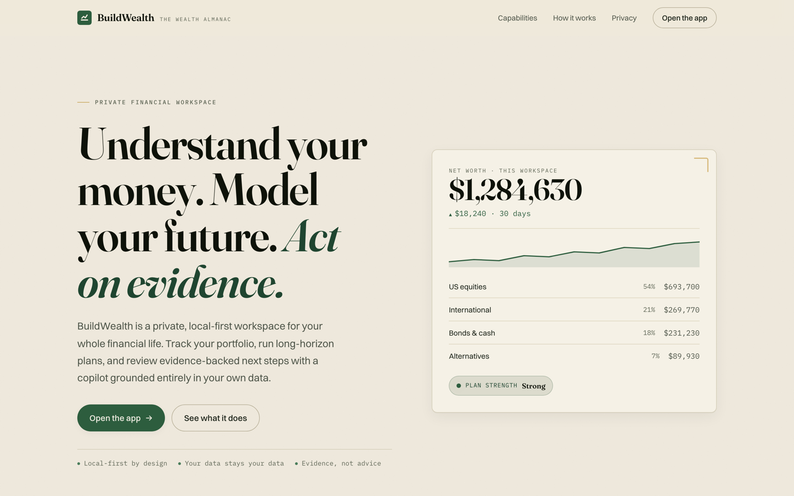
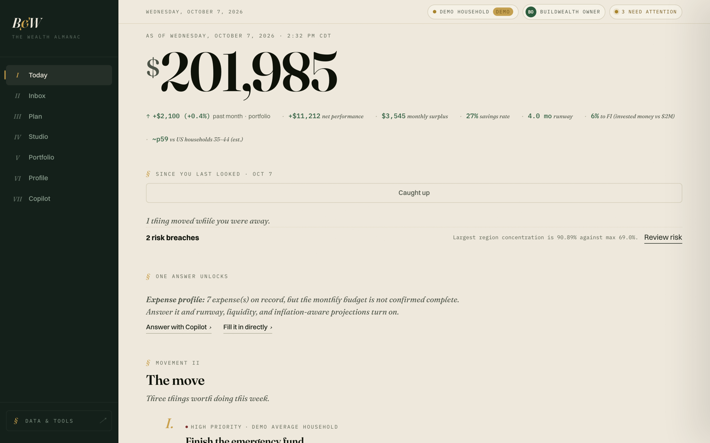
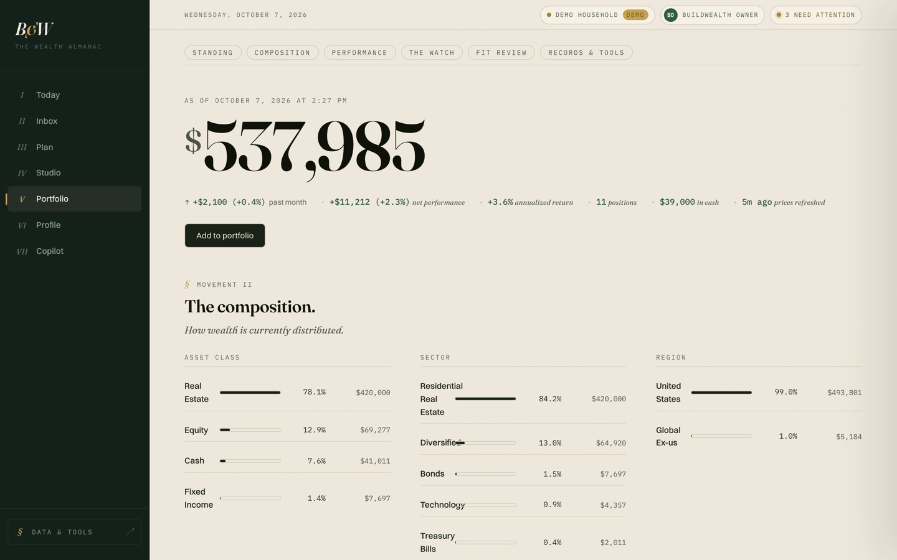
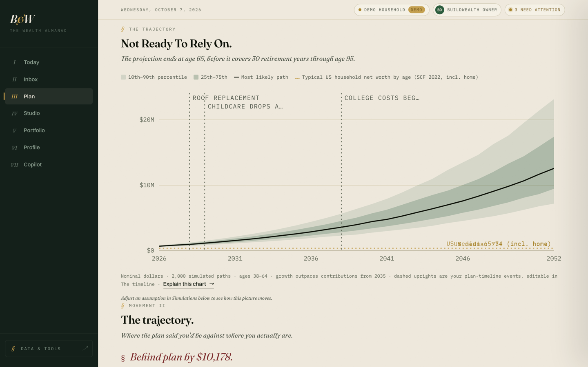
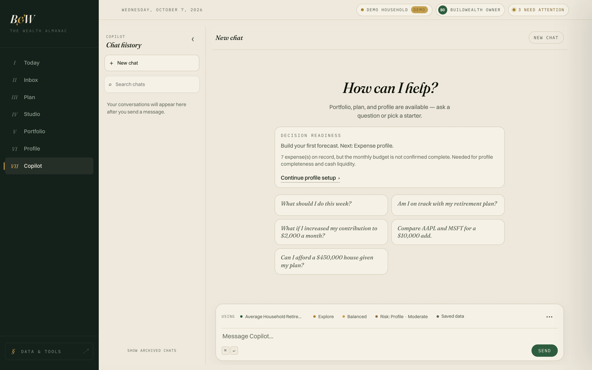
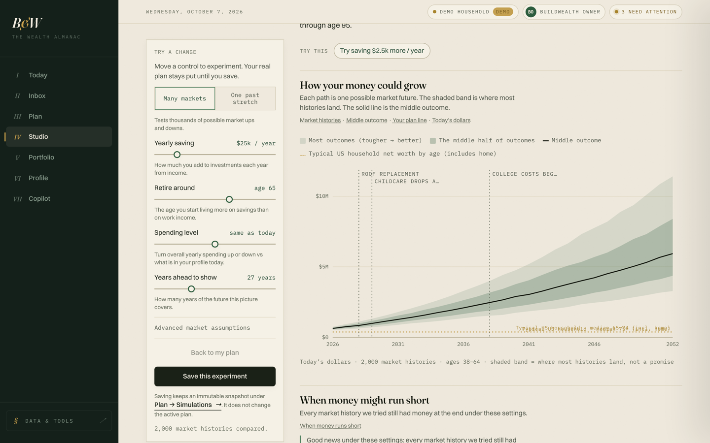
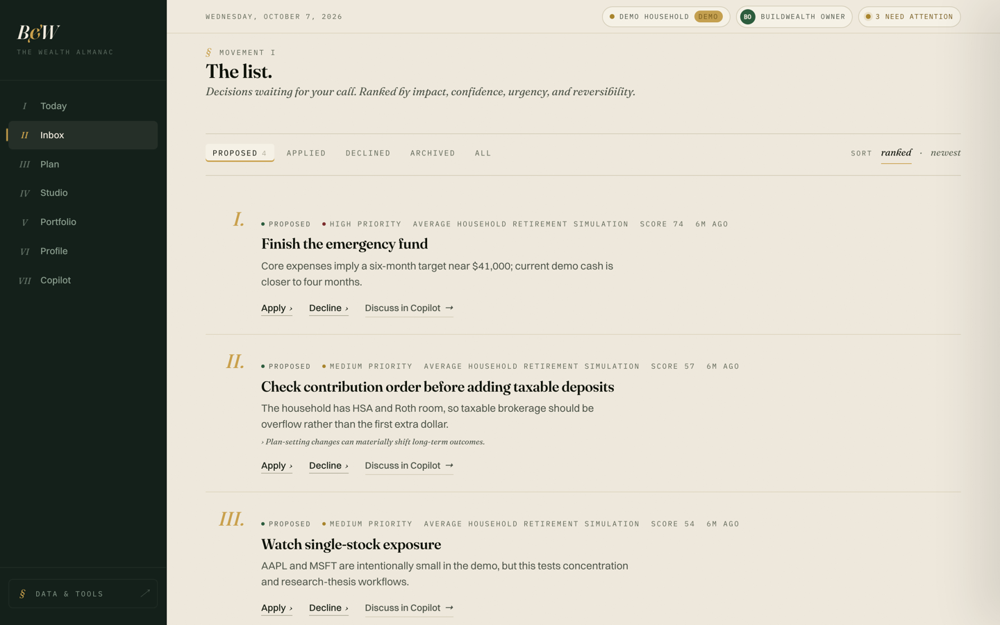
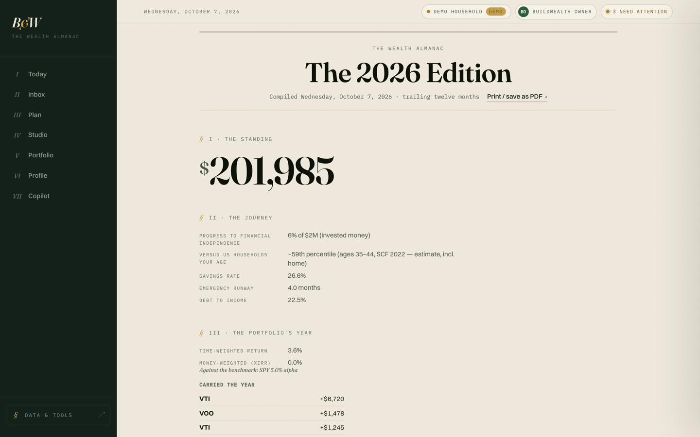
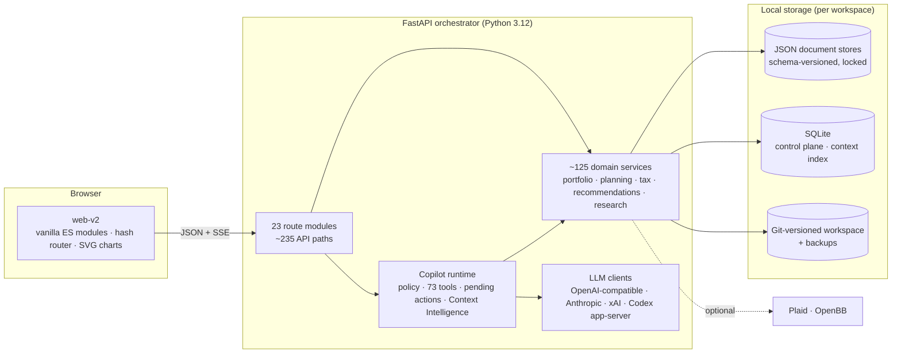

<p align="center">
  
</p>

<h1 align="center">BuildWealth</h1>

<p align="center">
  <strong>My personal finance app: a local-first command center for my household's money.</strong><br>
  It tracks the portfolio, models the next forty years, and includes an AI copilot that reasons over my real data but can never change it on its own.
</p>

<p align="center">
  
  
  
  
  
</p>

---

## Why I built this

I wanted one place that answers the questions I actually have about money: *Are we on track? What happens if we retire at 52 instead of 60? Is this fund just a duplicate of one we already own? What changed since last week, and does any of it matter?*

Off-the-shelf apps each answer a slice of that. None of them knows my whole picture, and I didn't want to hand all of it to a third-party server. So I built my own.

BuildWealth is **personal software**: built for one household (mine), shaped around my own questions, and changed whenever I need something new. It has no moat and no business model; I'm not competing with Monarch or Empower. What it does have is depth. It's ~90k lines of Python and ~33k lines of hand-written JavaScript, backed by 1,500+ tests. That's the scale where architecture, testing discipline and good judgment start to matter.

I'm open-sourcing it so people can see how I build software. If you're a hiring manager or an engineer, the [engineering highlights](#engineering-highlights) and [how I build](#how-i-build) sections are the best place to start.

> All screenshots and seed data in this repo use a synthetic demo household. None of it is my real financial data.

## A quick tour

| | |
|---|---|
|  |  |
| **Today**: a morning brief of what changed, what's due, and what deserves attention. | **Portfolio**: holdings, performance, risk, and fund overlap, each with its measurement window. |
|  |  |
| **Plan**: tax-aware, seeded Monte Carlo projections with percentile fan charts. | **Copilot**: an AI assistant grounded in my own data that can propose changes but never make them. |
|  |  |
| **Studio**: drag assumptions and watch 2,000 market histories re-run, without touching the saved plan. | **Inbox**: ranked, scored recommendations I can apply, decline, or discuss with the copilot. |

<p align="center"><br><em><strong>The Annual Edition</strong>: a printable year-in-review of the household's finances.</em></p>

## What it does

- **Portfolio tracking**
  - Accounts, transactions, and FIFO cost basis.
  - Multi-currency FX with history.
  - Performance against benchmarks, plus position-level attribution.
  - Risk alerts driven by a configurable policy (HHI concentration and an effective-positions floor).
  - Fund overlap and look-through.
  - Rebalancing and trade simulation.
  - Past snapshots rebuilt by replaying transactions.
- **Imports**
  - Broker CSV templates for Schwab, Fidelity, Vanguard, Robinhood, E\*TRADE and IBKR, run through an import workbench: preview, reconcile, de-duplicate, then apply.
  - Vision extraction turns a screenshot of a statement, paystub, W-2 or mortgage statement into a structured patch that I review before anything is saved.
- **Read-only bank connections**
  - Plaid, investment accounts only ([ADR 0007](docs/adr/0007-plaid-first-read-only-financial-connections.md)).
  - Webhook JWTs are verified, and access tokens are encrypted at rest.
- **Long-horizon planning**
  - Fixed, stochastic, historical (1928 onward) and Monte Carlo simulation modes.
  - Federal and state tax, capital gains and NIIT.
  - Contribution waterfalls that respect shared IRS limits.
  - RMDs, Social Security claiming, and Roth conversion windows.
  - Guardrail-style withdrawal strategies.
  - Plan branches for life events ("what if we move?").
  - A printable *Annual Edition* review.
- **Recommendations**
  - About a dozen generators, covering risk, plan drift, cash runway, allocation drift, stale assumptions and expiring investment theses, feed a scored inbox.
  - A background loop measures whether acted-on recommendations actually helped.
- **Research**
  - A watchlist with thesis revisions, research dossiers, and portfolio-fit checks.
  - Market data from OpenBB (optional).
- **AI Copilot**
  - 73 tools over my canonical data, with streaming answers.
  - Works with OpenAI, Anthropic, Gemini, xAI, and local models (Ollama, LM Studio), or my **ChatGPT subscription** instead of an API key.
- **Data durability**
  - Scheduled backups with restore.
  - Optionally, the whole workspace versioned in **git**, with auto-commits, diffs and previewed restores.

## Engineering highlights

The four areas I'm proudest of:

### 1. An AI copilot that can't touch my money

Letting an LLM near financial data is easy to demo and hard to make trustworthy. The design rule ([`copilot_policy.py`](services/orchestrator/src/buildwealth_orchestrator/services/copilot_policy.py)) is that **the model is never the authority on what's true or what changes.**

- **Every tool is typed by its financial effect:** `query`, `calculate`, `simulate`, `draft`, `write` or `apply`. Write and apply tools are never exposed to the model, and that rule is enforced in code, not left to prompt wording.
- **Changes go through a review queue.** When the model wants to change something, it creates a pending action. I review and apply it through a normal app route, and each action can only be applied once.
- **An authority ladder and prompt-injection rules.** Conversation text and the model's own recollection can never override canonical data. Imports, documents, notes, retrieved context and tool output are treated as untrusted, and instructions found inside them are never followed. When authoritative sources conflict, advice is labeled "Not Ready To Act On" until I review the conflict.
- **Context Intelligence** decides what the model sees.
  - A SQLite-backed context registry ranks results by keyword match, quality, recency and (optionally) embeddings.
  - It flags conflicting context and records a trace of what was retrieved for each answer.
  - **Embeddings are off by default and local-first (Ollama).** [ADR 0002](docs/adr/0002-embeddings-are-opt-in-for-context-intelligence.md) sets a concrete bar for changing that default: at least 20% better source recall, with no increase in wrong-source retrieval.
- **The model is pluggable.**
  - One OpenAI-compatible client covers OpenAI, Gemini, Ollama and LM Studio; Anthropic and xAI get native clients.
  - Models are routed per task (chat, summaries, extraction).
  - A usage-and-cost ledger records every call, and a "Test provider" button runs a real tool-call round trip.
- **ChatGPT subscription support.** [`codex_app_server.py`](services/orchestrator/src/buildwealth_orchestrator/services/codex_app_server.py) connects the copilot to OpenAI's Codex app-server, a JSON-RPC agent runtime, so a ChatGPT plan can power the copilot instead of a metered API key.
  - Device-code login works on a headless host.
  - The credential is encrypted per workspace and written into a temporary `CODEX_HOME` only for the length of each turn.
  - BuildWealth's tools are exposed as dynamic tools on a read-only thread.

### 2. A planning engine you can reproduce

[`scenario_engine.py`](services/orchestrator/src/buildwealth_orchestrator/services/scenario_engine.py) runs year-by-year, tax-aware projections across cash, taxable, tax-deferred and tax-free accounts.

- **Monte Carlo runs are seeded**, so the same plan with the same seed produces the same fan chart. Results can be tested, compared and explained.
- **Historical mode** replays actual market sequences from 1928 onward instead of assuming smooth averages.
- **Tax rules and withdrawals are modeled explicitly:**
  - federal brackets, capital gains, NIIT and state rates
  - contribution limits shared across accounts
  - RMDs using the IRS Uniform Lifetime table
  - Social Security claim-age comparisons
  - Roth conversion ladders and tax-loss-harvesting candidates
  - guardrail withdrawal strategies
- **Each strategy gets a plain-language explanation**, so the output says *why* a strategy wins, not just *that* it wins.

### 3. Honest numbers as a design rule

Finance UIs love a big green number with no context. I made "honest numbers" a rule:

- **No naked numbers.** Every change chip carries its delta, its percentage, and the window it was actually measured over ("past 31 days · portfolio"). It never implies a calendar month the snapshots don't cover ([`change_chip.js`](services/orchestrator/src/buildwealth_orchestrator/web-v2/lib/change_chip.js)).
- **Estimates say they're estimates.** Fund overlap and look-through are built from seeded index and holdings data, and each result states its limits.
- **Housing is shown separately.** Home equity has its own exposure line instead of inflating the diversification score.
- **The risk lens is exploratory and deterministic** ([ADR 0006](docs/adr/0006-risk-lens-is-exploratory-and-deterministic.md)). Comparing conservative, moderate and aggressive postures always gives the same answer for the same inputs, and records a fingerprint.
- **The health check checks things.** It tests the database, disk writability and free space instead of just returning `200 OK`.
- **The UI meets WCAG AA contrast.** The design system separates text-safe color steps from decorative ones (see [`tokens.css`](services/orchestrator/src/buildwealth_orchestrator/web-v2/styles/tokens.css)), so muted text never drops below WCAG AA.

### 4. Security that would survive a real review

It's personal software, but it holds the most sensitive data I have, so I hardened it as if it were going to be hosted:

- **Auth modes:** `dev`, `local` (PBKDF2-SHA256, 210k iterations), and hosted **OIDC**. OIDC uses PKCE S256, nonce checks, an ID-token algorithm allow-list, optional MFA enforcement, and a UserInfo subject check.
- **Request protection:** a CSRF header token on state-changing requests, and sliding-window rate limits on auth endpoints.
- **Secrets:** Fernet-encrypted per workspace and only ever shown by their last 4 characters. A **key-rotation** flow (preview, then apply) re-encrypts every workspace atomically and rolls back on failure.
- **Bank webhooks:** Plaid webhooks are verified as ES256 JWTs, with key-ID lookup, a 5-minute freshness window, and a constant-time SHA-256 check of the request body.
- **Deployment:** the production setup runs behind Caddy with a strict Content Security Policy.
- **Data handling:** optional 0600/0700 file-permission hardening, and account deletion with a recovery window enforced by a separate maintenance job.

### Also worth a look

- **Git as an undo history for financial data.** The workspace can auto-commit after edits settle. Diffs are shown in the UI, and restores need a short-lived preview token, so nothing is overwritten without a look first.
- **No frontend framework, no build step.**
  - The frontend is vanilla ES modules with a hash router.
  - Charts are SVG components I wrote by hand.
  - Styles come from a token-based design system I call the "Wealth Almanac".
  - It still has 360 unit tests and Playwright browser specs in CI.
- **Domain-driven docs.** [`CONTEXT.md`](CONTEXT.md) is a domain glossary that also lists the terms to *avoid* (e.g. "Context Intelligence, not *AI memory*"), plus a ranking of which data counts as the source of truth. Seven [ADRs](docs/adr/) record the decisions that matter.

## Architecture



- **Backend:** FastAPI, Pydantic v2 and httpx. Domain logic lives in plain service modules, and routes are thin.
- **Storage:** each workspace stores its data as JSON documents, with path-level locks and append-only schema migrations. A SQLite control plane holds users, organizations, workspaces, sessions and the audit log, and is designed so it can move to Postgres later.
- **Frontend:** served by the same process at `/v2`, with a separate marketing page at `/`.
- **Deployment:** Docker Compose for local use; Caddy with automatic HTTPS for production; Fly.io config included. See [`docs/DEPLOYMENT.md`](docs/DEPLOYMENT.md).

## By the numbers

| | |
|---|---|
| Python (app) | ~91k lines |
| Python (tests) | ~38k lines, **1,163** pytest tests |
| JavaScript (app) | ~33k lines, no framework |
| JavaScript (tests) | **360** `node:test` tests + **39** Playwright specs |
| HTTP API | ~235 endpoints across 23 route modules |
| Copilot tools | 73 |
| Architecture decision records | 7 |

CI runs pytest, the `node:test` suites, and Playwright on every push ([`ci.yml`](.github/workflows/ci.yml)).

## How I build

I build BuildWealth with AI coding agents (mainly Claude Code and Codex). I think that's worth stating plainly, because how I use them is part of what I want to show.

My working rule is **I own the judgment; agents do the labor.**

- **I design the architecture, interfaces and trade-offs.** Decisions that matter get an [ADR](docs/adr/). The domain language in [`CONTEXT.md`](CONTEXT.md) keeps people, agents and code using the same terms.
- **Features start as written plans.** I break a feature into a step-by-step plan with exact files, interfaces and acceptance criteria, which is what makes agent output reliable. A sample of these plans is in [`docs/archive/agent-plans/`](docs/archive/agent-plans/).
- **Tests are the contract.** 1,500+ tests let me accept or reject agent-written changes on evidence, not on how the diff looks.
- **I review every diff,** and I keep the calls that need taste (UX, naming, security posture, what *not* to build) for myself.

The full history of planning documents, including the ideas I abandoned, is in [`docs/archive/`](docs/archive/).

### Known trade-offs

Honest numbers apply to the codebase too:

- **`main.py` is still ~18.6k lines.** It started as the whole app. I've been splitting it into route modules and services (it was 23.5k lines), but shared helpers and the copilot tool registry still live there. Finishing that split is next on my list.
- **Ruff is configured but not enforced in CI yet.** The backlog is mostly unused imports.
- **The JSON-document stores are intentional for a single household,** and the trade-off is documented. A multi-tenant hosted version would move the control plane to Postgres; the abstraction for that already exists in `control_database.py`.

## Running it locally

**Requirements:** Docker, or Python 3.11+ and Node 22 for running without containers.

```bash
git clone https://github.com/BradyOnTech/BuildWealth.git
cd BuildWealth

make init-env                 # creates infra/env/orchestrator.env with a fresh secret key
make up                       # docker compose up; app on http://localhost:8090
./scripts/seed-demo-data.py   # optional: load the synthetic demo household
```

Then open **http://localhost:8090/v2**.

The copilot needs a model provider. In the app, go to **Connections & AI** and either add an API key, point it at a local Ollama, or connect a ChatGPT subscription. Details are in [`docs/LLM_PROVIDERS.md`](docs/LLM_PROVIDERS.md) and [`docs/CONFIGURATION.md`](docs/CONFIGURATION.md).

<details>
<summary><strong>Without Docker</strong></summary>

```bash
cd services/orchestrator
python -m pip install -e '.[dev]'
uvicorn buildwealth_orchestrator.main:app --port 8090
```
</details>

<details>
<summary><strong>Running the tests</strong></summary>

```bash
make test                                   # pytest + node:test suites
npm ci && npx playwright install chromium
make test-e2e                               # Playwright browser specs
```
</details>

## Documentation

| Doc | What's in it |
|---|---|
| [`CONTEXT.md`](CONTEXT.md) | Domain glossary, terms to avoid, and the source-of-truth ranking |
| [`docs/ARCHITECTURE.md`](docs/ARCHITECTURE.md) | System architecture |
| [`docs/adr/`](docs/adr/) | Architecture decision records |
| [`docs/CONFIGURATION.md`](docs/CONFIGURATION.md) | Auth modes, ChatGPT-subscription setup, maintenance jobs, endpoints, make targets |
| [`docs/LLM_PROVIDERS.md`](docs/LLM_PROVIDERS.md) | Model providers and per-task routing |
| [`docs/DEPLOYMENT.md`](docs/DEPLOYMENT.md) · [`docs/PRODUCTION_HOSTING_PLAN.md`](docs/PRODUCTION_HOSTING_PLAN.md) | Hosting and production setup |
| [`docs/HOSTED_PRIVACY_SECURITY_LAUNCH_REVIEW_2026-05-14.md`](docs/HOSTED_PRIVACY_SECURITY_LAUNCH_REVIEW_2026-05-14.md) | The security and privacy review I ran before considering hosting |
| [`docs/GIT_INTEGRATION_DESIGN.md`](docs/GIT_INTEGRATION_DESIGN.md) | Design of the git-versioned workspace |
| [`docs/archive/`](docs/archive/) | Historical plans and roadmaps |

## Disclaimer

BuildWealth is a personal project, not a financial product. Its projections are models built on assumptions, and nothing in it is financial, tax, or investment advice.

## License and credits

[MIT](LICENSE). Parts of the portfolio and planning design were informed by studying [Ghostfolio](https://github.com/ghostfolio/ghostfolio) and [Ignidash](https://github.com/schelskedevco/ignidash); see [ATTRIBUTIONS.md](ATTRIBUTIONS.md) for the details.
