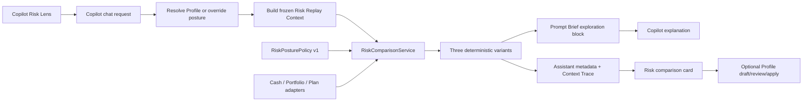

# Copilot Risk Lens & Risk-Posture Comparison — Implementation Plan (2026-07-15)

| Field | Value |
| --- | --- |
| **Title** | Copilot Risk Lens & Risk-Posture Comparison |
| **Date** | 2026-07-15 |
| **Status** | Approved product direction; ready for implementation |
| **Primary surface** | v2 Copilot |
| **Related surfaces** | Profile · Investing, Plan · Simulations, Portfolio, Inbox |
| **Related architecture** | `CONTEXT.md`, ADR 0004, ADR 0005, Copilot Session Focus, Simulations, Recommendation Factory |

---

## Outcome

BuildWealth will let a user explore the same financial decision under
conservative, moderate, and aggressive risk postures without changing the
user's saved Profile, active Plan, Portfolio, or Recommendations.

The experience must make the tradeoff easy to see and easy to move through:

- the composer shows a visible **Risk lens** control;
- the user may use the saved Profile posture or temporarily select any posture;
- a risk-relevant answer offers **Compare risk approaches**;
- one deterministic comparison run calculates all three postures from one
  frozen input bundle;
- the result card lets the user switch among postures instantly;
- Copilot explains the structured comparison rather than inventing three
  independent opinions;
- risk capacity affects warnings and recommendation status, never whether an
  option can be modeled or displayed;
- changing the saved Profile posture remains a separate draft/review/confirm
  action.

The governing product rule is:

> Exploration is always allowed. Constraints inform the result; they never
> suppress it.

---

## Decisions Locked By Product Review

1. **Risk is explorable, not a one-time verdict.** The saved Profile value is
   the default lens, not the only future BuildWealth will show.
2. **Risk capacity is evidence, not a gate.** An aggressive scenario must still
   render when cash, time horizon, concentration, or plan resilience make it a
   poor fit.
3. **`Not recommended` is not `not allowed`.** BuildWealth may strongly caution
   against a posture or candidate action, but it must show the calculations and
   tradeoffs.
4. **The LLM does not own the comparison.** A versioned deterministic service
   owns posture resolution, candidate scoring, calculations, and status. The
   LLM explains those results.
5. **Exploration never mutates Canonical State.** Risk-lens changes are
   conversation-scoped. Profile or Plan changes use existing explicit
   draft/review/apply boundaries.
6. **“Same conditions” is a testable promise.** Every posture in one comparison
   shares an input fingerprint, portfolio snapshot, Plan revision, assumption
   set, Profile revision, question, and candidate set.
7. **Use discrete postures, not a continuous numeric slider.** The UI may feel
   slider-like, but its stops are Conservative, Moderate, and Aggressive. This
   avoids false precision and matches the existing schema.
8. **Aggressive does not mean careless.** Taxes, restrictions, research quality,
   diversification, and concentration remain visible. A posture changes how
   valid candidates are ranked; it does not erase evidence.
9. **Existing review boundaries remain.** A user can always explore and save a
   scenario or branch. Applying a change to the active Plan or Profile still
   requires explicit confirmation. A `not_recommended` status alone must never
   be an apply prohibition.

---

## Terminology

Add these terms to `CONTEXT.md` and use them consistently in code and UI.

**Risk Tolerance**  
The user's durable, confirmed willingness to accept volatility and loss in
pursuit of reward. Stored in `Profile.investment_policy.risk_tolerance`.

**Risk Capacity**  
The evidence-based ability of the user's current financial situation to absorb
loss, volatility, illiquidity, or delay without undermining required goals,
liabilities, reserves, or timeline needs. Risk Capacity is calculated context,
not a user permission boundary.

**Risk Posture**  
One of `conservative`, `moderate`, or `aggressive`, used as a deterministic
comparison input.

**Risk Lens**  
The conversation-scoped selection that tells Copilot which Risk Posture to lead
with. It may resolve from the saved Profile or be an explicit temporary
override.

**Risk Comparison Run**  
A read-only calculation of multiple Risk Postures against one frozen input
bundle. The run produces comparable variants and an audit fingerprint.

**Risk Replay Context**  
A bounded, versioned set of the numerical inputs and source references needed
to reproduce a risk-relevant Copilot answer later under another posture. It is
stored with the assistant turn, not in Profile.

Avoid:

- `risk score` for the user's posture;
- treating `conservative`, `moderate`, and `aggressive` as LLM tone settings;
- `blocked` or `forbidden` when the only issue is risk fit;
- silently mapping aggressive posture to concentrated or unresearched bets;
- changing expected market returns merely because the user selected a more
  aggressive posture.

---

## Goals

1. Make risk posture visible and adjustable in the normal Copilot workflow.
2. Re-render a risk-relevant decision under another posture without changing
   the facts or regenerating the other variants from different snapshots.
3. Compare all three postures in one compact, structured view.
4. Let Copilot explain what changed, why it changed, and what did not change.
5. Show aggressive and otherwise poor-fit outcomes completely, with quantified
   warnings and a clear recommendation status.
6. Preserve the difference between a temporary exploration lens and the saved
   Profile preference.
7. Reuse BuildWealth-native Plan, Portfolio, Profile, Simulation, and
   Recommendation services instead of creating a parallel LLM calculator.
8. Make the comparison auditable through assistant metadata and Context Trace.

## Non-Goals

- Automatically changing the user's saved risk tolerance.
- Reducing risk to a continuous score or psychometric questionnaire.
- Treating age alone as risk tolerance or risk capacity.
- Promising that all three postures must produce different recommendations.
  Identical outcomes are valid when the same constraints or evidence dominate.
- Allowing the LLM to invent portfolio returns, asset-class assumptions, or
  candidate actions without a BuildWealth calculation.
- Adding classic/v1 UI support.
- Executing brokerage trades.
- Removing existing confirmation requirements for Canonical State mutations.

---

## Current State (Verified 2026-07-15)

### Foundation already present

- Profile has the canonical enum `conservative | moderate | aggressive` and a
  plain-language Investing form.
- The Profile investment policy is included in the Copilot Prompt Brief.
- Copilot conversations already persist Session Focus and per-conversation LLM
  settings; the same lifecycle can carry a Risk Lens.
- Copilot assistant messages already persist structured metadata, tool traces,
  Context Trace, message ids, and durable turn ids.
- v2 Copilot already renders specialized cards for Profile drafts, Portfolio
  fit, Plan review, and scenario diffs.
- Plan scenario diff already supports read-only candidate comparison before
  apply.
- Recommendation factories already support `dry_run=True` with no creator.
- The cash-liquidity factory already varies its excess-cash reserve ceiling by
  saved risk tolerance: conservative 9 months, moderate/default 6, aggressive 4.

### Gaps this plan closes

- The saved Profile value is always-on Copilot context, but there is no
  conversation-scoped Risk Lens.
- Risk tolerance is not a Plan scenario field and is not represented in the
  Copilot chat request or response.
- There is no common, versioned risk-posture policy or comparison response.
- Current risk-sensitive deterministic behavior is too narrow to support a
  broadly useful comparison.
- Copilot has no direct, structured way to say “use this exact answer's inputs
  and show the other postures.”
- Risk capacity and recommendation status are not separate response axes.
- There is a vocabulary bug: the Copilot onboarding chip sends `balanced`,
  while Profile and context extraction accept `moderate`.
- The system prompt says when advice is not decision-grade, but does not yet
  explicitly say that exploratory calculations must still be shown.

---

## Product Contract

### Independent axes

Every variant reports three independent states:

1. **Exploration status** — could BuildWealth calculate the scenario?
   - `complete`
   - `partial` (some inputs or calculators unavailable; show what is available)
   - `unavailable` (technical or invalid-input failure only)
2. **Recommendation status** — how BuildWealth assesses the variant:
   - `recommended`
   - `reasonable`
   - `caution`
   - `not_recommended`
3. **Capacity fit** — how the posture fits the user's financial capacity:
   - `within_capacity`
   - `stretches_capacity`
   - `exceeds_capacity`
   - `unknown`

Required invariant:

```text
recommendation_status == "not_recommended"
or capacity_fit == "exceeds_capacity"

MUST NOT imply

exploration_status == "unavailable"
```

### What remains frozen

One Risk Comparison Run freezes:

- user question or originating candidate decision;
- active workspace and household;
- Profile revision except for the in-memory posture override;
- portfolio snapshot timestamp and holdings/allocation fingerprint;
- active Plan id and revision;
- active assumption set and simulation settings;
- goals, income, expenses, debts, taxes, restrictions, research-quality rules,
  and other non-risk preferences;
- candidate actions evaluated by the domain adapter;
- market/research evidence timestamps;
- policy and calculator versions.

The service deep-copies its inputs before evaluating postures. No variant may
reload a fresher snapshot or changed Plan while the run is in progress.

### What a posture may change

A Risk Posture may change only versioned decision-policy inputs, including:

- how strongly downside, liquidity, and upside affect candidate ranking;
- which already-valid candidate is recommended;
- optional-cash reserve ceiling (existing 9 / 6 / 4 month behavior);
- which outcome metrics lead the explanation;
- whether a candidate is labeled recommended, caution, or not recommended.

A posture does **not** silently change:

- portfolio holdings;
- the saved target allocation;
- user restrictions or concentration limits;
- tax sensitivity or simplicity preference;
- research confidence requirements;
- goal dates, required spending, or debt;
- market return assumptions;
- the active Plan assumption set.

If a future adapter wants to test a different asset allocation, that allocation
must be an explicit candidate action with an explicit diff. The allocation—not
the posture label—drives its modeled return and drawdown.

### What happens when the result is risky

BuildWealth still renders:

- the proposed strategy or position;
- expected upside and relevant reward metrics;
- loss, drawdown, liquidity, tax, concentration, and Plan-resilience effects;
- capacity fit and why;
- BuildWealth's recommendation status;
- the steps required to preview, save, or review the candidate further.

Preferred language:

> Here is the aggressive version. It increases the modeled upside by X, but
> raises drawdown exposure to Y and makes the Plan fragile in Z modeled paths.
> BuildWealth would not recommend adopting it under the current cash and
> timeline conditions, but the scenario remains available to explore and save.

Forbidden behavior:

- refusing to run solely because the selected posture is aggressive;
- omitting the aggressive column because it exceeds capacity;
- replacing results with a generic warning;
- quietly snapping the selection back to the Profile posture;
- changing Canonical State as a side effect of comparison.

---

## UX Specification

### 1. Composer Risk Lens

Add a compact control to the existing composer context row:

```text
Risk lens: Profile · Moderate  v
```

Expanded state:

```text
Use my profile | Conservative | Moderate | Aggressive
```

Behavior:

- `Use my profile` is the default and resolves the current confirmed Profile
  value each turn.
- Selecting an explicit posture updates the conversation-scoped lens, not the
  Profile.
- When overridden, show a persistent visible label above the composer:
  `Exploring Aggressive · Saved profile remains Moderate`.
- The control remains visible while overridden; it must not become a hidden
  setting.
- Keyboard: arrow keys move among the three explicit stops; Home/End move to
  first/last; the Profile option is separately reachable.
- Screen reader label describes the temporary nature of the selection.
- Small screens use horizontally scrollable segmented buttons or a native
  select; never shrink labels into ambiguous initials.

Changing the composer lens affects the next question. It does not automatically
spend an LLM request.

### 2. Risk-relevant answer prompt

After a risk-relevant answer, render structured response actions:

- **Compare risk approaches**
- **View as Conservative / Moderate / Aggressive** when a comparison already
  exists
- **Use this as my default** when viewing an explicit posture

Do not append this prompt to tax, data-recovery, profile-entry, or other turns
where risk posture has no material effect. Eligibility comes from the
deterministic adapter result, not an LLM guess.

### 3. Comparison card

One comparison run calculates all three variants. The card displays:

```text
Risk approaches                         Same inputs · compared Jul 15

[ Conservative ] [ Moderate ] [ Aggressive ]

Suggested approach    ...
Expected upside       ...
Downside exposure     ...
Liquidity retained   ...
Plan strength         ...
Capacity fit          Exceeds capacity
BuildWealth view      Not recommended
Main tradeoff         ...

This is an exploration. Your Profile and active Plan are unchanged.
```

Desktop may show a three-column comparison when space permits. Mobile and the
default chat layout use tabs/segmented stops with one detail panel. Switching
postures after the run is client-only and instant; it does not rerun the LLM or
reload financial data.

Always expose a **What stayed the same** disclosure containing the frozen input
summary and comparison timestamp.

### 4. Copilot explanation

The selected posture leads the prose answer. The structured comparison card is
the source of truth.

When asked to compare, Copilot should explain:

- what recommendation changed;
- which deterministic metric or policy caused the change;
- what did not change;
- upside gained;
- downside or capacity cost;
- whether all postures produced the same answer and why;
- which calculations are partial or unavailable.

The explanation must not claim that a posture caused a different projected
return unless an explicit modeled candidate (for example, an allocation
change) changed the return inputs.

### 5. Re-rendering an existing answer

For new risk-relevant turns, persist bounded Risk Replay Context with the
assistant message. When the user selects another posture from that answer:

1. use the stored replay context;
2. calculate all three variants in one run;
3. link the result to the source turn and assistant message;
4. keep the source input fingerprint visible in Context Trace.

For historical turns without replay context:

- never refuse the comparison;
- run against current Canonical State;
- label it `Using current financial data; the original answer did not save a
  replayable input bundle`;
- show any detectable source revision drift.

### 6. “Use this as my default”

This action must use the existing Profile draft/review/apply flow:

1. create `draft_financial_profile_update` with
   `investment_policy.risk_tolerance` changed;
2. show the current and proposed posture;
3. explain that future `Use my profile` turns will resolve to the new value;
4. save only after explicit confirmation;
5. keep the active comparison available regardless of save/cancel.

Fix the user-facing label mapping at the same time:

- UI label may be `Moderate` or `Balanced`;
- wire/storage value is always `moderate`;
- accept legacy `balanced` input as a normalized alias during migration, but
  never persist it.

---

## Architecture



### New services

Create:

- `services/risk_lens.py`
  - enum/alias normalization;
  - Profile posture resolution;
  - conversation selection normalization;
  - `RiskPosturePolicyV1`;
  - common status and explanation helpers.
- `services/risk_comparison.py`
  - frozen input construction;
  - input fingerprinting;
  - adapter selection;
  - candidate-set evaluation;
  - all-posture orchestration;
  - comparison and replay payload construction.

Do not put risk-posture rules in the web client or system prompt.

### Risk-posture policy v1

The policy is code-owned, versioned, and testable. Initial values:

| Policy field | Conservative | Moderate | Aggressive |
| --- | ---: | ---: | ---: |
| Optional-cash reserve ceiling | 9 months | 6 months | 4 months |
| Downside weight | highest | balanced | lower, never zero |
| Liquidity weight | highest | balanced | lower, never zero |
| Upside weight | lower | balanced | highest |
| Lead outcome view | downside-first | balanced | upside-first |

The exact numeric scoring weights must live in one policy constant and be
covered by ordering tests. Do not duplicate the 9/6/4 mapping in the cash
factory after this service lands; inject or call the shared policy.

The policy must not alter concentration caps, restrictions, tax rules, or
research-quality requirements. Those remain independent evidence and
guardrails. Their breaches may produce `not_recommended`, but never suppress
the variant.

### Candidate-first comparison

Postures rank a shared set of explicit candidate actions. They do not ask the
LLM to invent one candidate per posture.

For every adapter:

1. derive a bounded candidate set once from frozen inputs;
2. calculate each candidate's outcome once where possible;
3. score the same candidates under each Risk Posture Policy;
4. select the leading candidate per posture;
5. report the full tradeoff and status;
6. retain all candidates in compact evidence for audit/debugging.

This makes it possible for the three postures to select different actions while
preserving apples-to-apples conditions.

### Domain adapters

#### Adapter 1: cash liquidity — first vertical slice

Reuse the existing cash-liquidity factory inputs and dry-run behavior.

Candidate set:

- preserve current cash;
- deploy only cash above the posture reserve ceiling;
- use available deployment destinations already derived from goals, debt, and
  target allocation;
- where data supports it, compare partial deployment with the full eligible
  amount.

The existing 9/6/4 behavior becomes policy-owned. A household below the normal
minimum reserve may still explore deployment; that variant reports the
resulting shortfall and likely `not_recommended` / `exceeds_capacity` status.
It is not omitted.

#### Adapter 2: Portfolio position and allocation

Reuse `simulate_trade`, `assess_portfolio_fit`, allocation, concentration,
tax-lot coverage, and investment-policy evidence.

Candidate set depends on the user's question and may include:

- no change;
- the user's requested position/trade exactly as stated;
- a smaller bounded version when calculable;
- a diversified destination derived from the user's explicit target mix;
- a contribution-only alternative that avoids a taxable sale.

Do not fabricate a 40/60/80 equity allocation from the posture label. If an
allocation change is modeled, return its explicit before/after weights.

An aggressive posture may rank the requested growth candidate more highly, but
the card still shows concentration, research, tax, and capacity evidence.

#### Adapter 3: Plan decisions and Plan Levers

Reuse Plan scenario diff, Plan simulation analysis, Plan Strength, impact
policy, and saved-simulation contracts.

Candidate set may include:

- current Plan/no change;
- the user's requested lever;
- existing nearby bounded levers already generated by Plan;
- an explicit branch where the change is high impact.

The posture changes candidate ranking and which outcomes lead. It does not
change the Plan's market assumptions invisibly. Every modeled setting change
appears in the scenario diff.

All postures may be saved as Simulations or branches, including those labeled
`not_recommended`.

#### Adapter 4: Recommendation Factory expansion

After the first three adapters are stable, pass Risk Lens context through
risk-sensitive factories and ranking. Keep non-risk-sensitive factories
unchanged.

Initial candidates for integration:

- cash liquidity;
- allocation drift;
- portfolio risk/fit;
- plan tracking where multiple valid corrective actions exist;
- simulation-backed Plan recommendations.

Factory persistence stays off during exploration. A user may separately draft
an Inbox recommendation from a variant after review.

### Risk Replay Context

Store a bounded payload only for turns classified by a deterministic adapter as
risk-relevant:

```json
{
  "schema_version": 1,
  "intent": "cash_deployment",
  "source_turn_id": "turn_...",
  "source_assistant_message_id": "msg_...",
  "question": "What should I do with excess cash?",
  "workspace_id": "...",
  "plan_id": "...",
  "input_fingerprint": "sha256:...",
  "snapshot_as_of": "...",
  "profile_updated_at": "...",
  "plan_updated_at": "...",
  "assumption_set_id": "default",
  "policy_version": "risk_posture_policy_v1",
  "adapter_version": "cash_liquidity_v1",
  "inputs": {
    "monthly_outflow_usd": 0,
    "cash_usd": 0,
    "relevant_policy": {},
    "candidate_actions": []
  }
}
```

Requirements:

- cap serialized replay context size;
- store only inputs required by the selected adapter;
- do not copy raw documents, research prose, unrelated Profile sections, API
  keys, or full conversation history;
- hash normalized input ordering deterministically;
- include version ids so old comparisons remain understandable after policy
  changes;
- replay services receive copied payloads and cannot write to workspace stores.

### Comparison response contract

Add typed schemas in `schemas.py`:

```python
RiskPosture = Literal["conservative", "moderate", "aggressive"]

class RiskLensSelection(BaseModel):
    mode: Literal["profile", "override"] = "profile"
    posture: RiskPosture | None = None
    set_by: Literal["user", "entry_surface", "default"] = "default"
    schema_version: int = 1

class RiskComparisonIntent(BaseModel):
    mode: Literal["selected", "all"] = "selected"
    source_turn_id: str | None = None
    source_assistant_message_id: str | None = None

class RiskComparisonVariant(BaseModel):
    posture: RiskPosture
    exploration_status: Literal["complete", "partial", "unavailable"]
    recommendation_status: Literal[
        "recommended", "reasonable", "caution", "not_recommended"
    ]
    capacity_fit: Literal[
        "within_capacity", "stretches_capacity", "exceeds_capacity", "unknown"
    ]
    suggested_action: dict[str, Any]
    metrics: dict[str, Any]
    upside: list[str]
    downside: list[str]
    capacity_reasons: list[str]
    warnings: list[str]
    main_tradeoff: str

class RiskComparisonResult(BaseModel):
    comparison_id: str
    generated_at: datetime
    selected_posture: RiskPosture
    profile_posture: RiskPosture | None
    input_fingerprint: str
    conditions_source: Literal["original_turn", "current_state"]
    policy_version: str
    adapter_id: str
    adapter_version: str
    applicable: bool
    frozen_conditions: dict[str, Any]
    variants: list[RiskComparisonVariant]
    shared_warnings: list[str]
```

Validation rules:

- explicit override requires a posture;
- `profile` mode ignores any supplied posture and resolves server-side;
- comparison variants contain each requested posture exactly once;
- an all-posture comparison returns conservative, moderate, aggressive in that
  stable order;
- all variants share one input fingerprint;
- `unavailable` requires a technical/invalid-input reason and cannot be caused
  solely by `not_recommended` or `exceeds_capacity`;
- normalize incoming `balanced` to `moderate` before schema persistence.

### Copilot request, response, and conversation changes

Extend `CopilotChatRequest`:

```python
risk_lens: RiskLensSelection | None = None
persist_risk_lens: bool = True
risk_comparison: RiskComparisonIntent | None = None
```

Extend `CopilotChatResponse`:

```python
risk_lens: RiskLensSelection | None = None
risk_comparison: RiskComparisonResult | None = None
```

Extend `CopilotConversationResponse` with the stored Risk Lens selection.

Conversation storage:

```json
{
  "risk_lens": {
    "mode": "override",
    "posture": "aggressive",
    "set_by": "user",
    "schema_version": 1,
    "updated_at": "..."
  }
}
```

Store the selection, not a stale `resolved_profile_posture`. Resolve Profile
mode from current Canonical State each turn. Record the resolved posture in the
assistant metadata and Context Trace for audit.

### Chat pipeline ordering

In `_copilot_chat_pipeline`:

1. load/create conversation;
2. resolve and optionally persist Session Focus;
3. resolve and optionally persist Risk Lens independently;
4. assemble normal Copilot context;
5. classify whether the turn is risk-comparison applicable;
6. build or load Risk Replay Context;
7. when explicitly requested or required by an override, run all three posture
   variants from one copied input bundle;
8. add a compact `exploration.risk_lens` and
   `exploration.risk_comparison_summary` block to the Prompt Brief;
9. call Copilot for explanation;
10. persist full structured comparison and replay context in assistant metadata;
11. return the same structured comparison in blocking and streaming responses.

Do not place the full comparison inside Context Trace and assistant content in
duplicate. Store the full object once in assistant metadata; keep ids, versions,
fingerprint, selected posture, Profile posture, conditions source, and statuses
in Context Trace.

Extend `FinancialCopilot.chat` with a server-owned `assistant_metadata` argument.
The runtime merges that object with `tool_calls`, `model`, and `context_trace`
when it appends the assistant message, and returns the structured Risk Lens and
comparison fields in the route result. Do not accept arbitrary assistant
metadata from the browser. This keeps blocking responses, streaming responses,
conversation reloads, and the persisted message on one serialization path.

### System prompt changes

Add a dedicated Risk Lens section:

- Risk Lens is an exploratory preference, not Canonical State.
- Use the deterministic comparison result whenever present.
- Never refuse to calculate or discuss a posture solely because it is risky,
  not recommended, or exceeds capacity.
- Clearly state recommendation status and capacity evidence.
- Never imply that `not_recommended` means prohibited.
- Never claim Profile or Plan changed unless an explicit reviewed mutation tool
  succeeded.
- Never invent differences when variants share the same leading candidate.
- For “compare risk” without a precomputed result, use the native comparison
  tool/service rather than composing three opinions.

Expose the same `RiskComparisonService` as a Copilot tool for conversational
follow-ups, but the UI's explicit Compare action should invoke deterministic
precomputation in the route so rendering does not depend on whether the LLM
chooses the tool.

### Context Trace

Add:

```json
{
  "risk_lens_applied": {
    "selection_mode": "override",
    "selected_posture": "aggressive",
    "profile_posture": "moderate",
    "temporary": true,
    "comparison_id": "riskcmp_...",
    "input_fingerprint": "sha256:...",
    "conditions_source": "original_turn",
    "policy_version": "risk_posture_policy_v1",
    "adapter_id": "cash_liquidity",
    "variant_statuses": {
      "conservative": "reasonable",
      "moderate": "reasonable",
      "aggressive": "not_recommended"
    }
  }
}
```

Update the Sources & Calculations summary with a compact label such as:

`Aggressive lens · profile Moderate · 3 postures compared · same inputs`

### Frontend state and rendering

Prefer a new module:

- `web-v2/views/copilot/risk_lens.js`
  - normalization and client state;
  - composer control renderer;
  - comparison action renderer;
  - comparison card renderer;
  - frozen-condition disclosure;
  - accessibility labels and keyboard behavior.

Integrate with:

- `views/copilot.js`
  - load/reset/persist conversation Risk Lens;
  - add request payload fields;
  - store response metadata;
  - handle Compare, posture tabs, and default-draft actions;
  - preserve Risk Lens through retry and streaming fallback.
- `views/copilot/composer.js`
  - accept Risk Lens context HTML/action callbacks without mixing policy logic
    into the stateless textarea component.
- `views/copilot/thread.js`
  - render comparison metadata as a first-class card before generic tool traces;
  - render the temporary Profile distinction;
  - expose Compare action only when eligible.
- `styles/copilot.css`
  - segmented control, override banner, comparison card, status language,
    responsive layout, focus-visible states, and reduced-motion behavior.

Assistant message metadata in the client:

```js
metadata: {
  tool_calls,
  model,
  context_trace,
  risk_lens,
  risk_comparison,
  risk_replay_context,
}
```

Do not derive recommendation or capacity status in JavaScript. Render the
server-owned values and human explanations.

---

## Implementation Sequence

Each phase should be independently testable and safe to merge. Keep the first
vertical slice end to end instead of landing an unused generic engine.

### Phase 1 — Vocabulary, contracts, and normalization

Files:

- `CONTEXT.md`
- new `docs/adr/0006-risk-lens-is-exploratory-and-deterministic.md`
- `schemas.py`
- new `services/risk_lens.py`
- `services/context_intelligence.py`
- `web-v2/views/copilot.js`

Work:

- add terminology and non-blocking exploration invariant;
- add typed Risk Lens and comparison schemas;
- add Profile/override resolution and alias normalization;
- normalize `balanced` to `moderate`;
- fix the onboarding quick-reply payload;
- define and test `RiskPosturePolicyV1` in one location;
- document that posture is independent from Session Focus and Materiality.

Exit criteria:

- no code path persists `balanced`;
- all selection validation and policy ordering tests pass;
- `not_recommended` / `exceeds_capacity` cannot validate as an exploration
  failure without a separate technical reason.

### Phase 2 — Deterministic cash-liquidity vertical slice

Files:

- new `services/risk_comparison.py`
- `services/recommendation_factory.py`
- `routes/recommendations.py` where shared orchestration is useful
- `tests/test_risk_lens.py`
- `tests/test_risk_comparison.py`
- existing excess-cash/recommendation-factory tests

Work:

- extract 9/6/4 reserve policy from the factory;
- build frozen cash-liquidity replay inputs;
- generate one candidate set;
- score/select candidates for all three postures;
- return complete variants even when deployment exceeds capacity;
- prove dry-run exploration does not modify Recommendations, Profile, Plan, or
  Portfolio stores;
- add deterministic fingerprinting and policy/adapter versioning.

Exit criteria:

- one request returns all three variants with one fingerprint;
- conservative, moderate, and aggressive use identical cash/outflow/goal inputs;
- aggressive deployment below capacity still renders and is labeled rather
  than rejected;
- no workspace file changes during comparison.

### Phase 3 — Copilot transport, persistence, and guaranteed precomputation

Files:

- `schemas.py`
- `routes/copilot.py`
- `services/copilot_runtime.py`
- `services/copilot_prompt_brief.py`
- `main.py` tool registration and system prompt
- `tests/test_copilot_routes.py` and existing Copilot tests

Work:

- add Risk Lens request/response/conversation fields;
- add `ConversationStore.update_risk_lens`;
- resolve the selection independently from Session Focus;
- construct bounded Risk Replay Context;
- precompute comparison for explicit Compare or override turns;
- inject a compact exploration summary into the Prompt Brief;
- persist structured result and replay context on the assistant message;
- return identical data through blocking and SSE result paths;
- expose comparison as a Copilot tool for follow-ups;
- add Context Trace summary and system-prompt behavior.

Exit criteria:

- conversation override persists across turns and reloads;
- Profile mode resolves the current saved value without copying it into the
  conversation;
- streaming retry preserves the Risk Lens and source turn;
- the LLM cannot prevent the explicit Compare action from producing a
  structured card;
- assistant prose is grounded in the precomputed result.

### Phase 4 — v2 Copilot Risk Lens and comparison UI

Files:

- new `web-v2/views/copilot/risk_lens.js`
- `web-v2/views/copilot.js`
- `web-v2/views/copilot/composer.js`
- `web-v2/views/copilot/thread.js`
- `web-v2/styles/copilot.css`
- new and existing web-v2 node tests
- Copilot Playwright specifications

Work:

- add Profile/three-stop composer control;
- add override banner;
- add contextual Compare action;
- render all-posture comparison card;
- switch stored variants instantly without network or LLM calls;
- show frozen conditions and Profile/temporary distinction;
- add `Use this as my default` Profile draft handoff;
- support keyboard, screen reader, small-screen, high-contrast, and reduced-motion
  behavior;
- preserve state through conversation history, reset, archive, retry, and model
  changes.

Exit criteria:

- a user can identify the active lens without opening settings;
- the aggressive variant is visible even when not recommended;
- switching comparison tabs does not issue a request;
- Profile and active Plan remain unchanged after exploration;
- saving a default requires draft review and explicit confirmation.

### Phase 5 — Portfolio and Plan adapters

Files:

- `services/risk_comparison.py` adapter modules if the file becomes large
- `services/portfolio_fit.py`
- portfolio simulator and allocation services as needed
- Plan scenario/lever/simulation services
- Copilot tool and card renderers
- backend, node, and browser tests

Work:

- add shared candidate-first Portfolio comparison;
- add Plan Lever/scenario comparison;
- attach explicit setting/allocation diffs;
- keep taxes, restrictions, concentration, and research evidence visible;
- allow every variant to be saved as a Simulation or branch;
- add Copilot explanations for identical recommendations across postures.

Exit criteria:

- trade and Plan questions can produce materially different leading candidates
  without changing frozen facts;
- any return difference points to an explicit modeled candidate change;
- capacity warnings do not suppress results or save-simulation actions;
- high-impact application still uses normal review/decision evidence.

### Phase 6 — Recommendation integration and launch hardening

Files:

- risk-sensitive Recommendation Factory sources and scoring
- Today/Inbox links where appropriate
- Context Trace/UI polish
- product docs and testing checklist

Work:

- thread Risk Lens through eligible factory previews;
- let a reviewed variant draft an Inbox recommendation without auto-creating it;
- prompt for comparison from risk-relevant Today/Inbox entries;
- add telemetry/audit counters without recording sensitive free-form content;
- run full regression and first-time-customer browser validation;
- update roadmap/source-of-truth docs only after behavior is verified.

Exit criteria:

- comparison works from Copilot and linked risk-relevant entry surfaces;
- factory dry runs remain non-persistent;
- no broad recommendation generation occurs merely from moving the lens;
- release evidence covers unrestricted exploration, Profile non-mutation, and
  all three postures.

---

## Test Plan

### Backend unit tests

Risk selection and policy:

- Profile mode resolves `conservative`, `moderate`, and `aggressive`.
- Explicit override does not mutate the Profile payload.
- `balanced` normalizes to `moderate` and is never persisted.
- invalid posture returns validation error.
- policy version and values are stable and centralized.

Comparison invariants:

- all three variants share one normalized input fingerprint;
- stable posture ordering;
- copied input bundle prevents one adapter run from contaminating another;
- identical inputs and policy produce identical results;
- `not_recommended` variants remain `complete` when calculation succeeds;
- `exceeds_capacity` variants remain visible;
- `unavailable` requires technical or invalid-input evidence;
- no comparison path receives a Recommendation creator or apply flag;
- source revision drift is detected and labeled.

Risk Replay Context:

- bounded payload size;
- excludes unrelated Profile sections and raw documents;
- version mismatch degrades to current-state comparison with a warning;
- historical turn without replay context does not fail.

### API and Copilot integration tests

- chat request accepts Profile and override selections;
- stored conversation selection reloads;
- Profile mode follows a later confirmed Profile change;
- explicit Compare precomputes a result before LLM completion;
- blocking and streaming endpoints return the same comparison contract;
- failed/stopped/retried turns preserve source ids and Risk Lens;
- assistant metadata contains comparison and replay context;
- Context Trace contains posture, Profile distinction, fingerprint, versions,
  and conditions source;
- system brief includes compact comparison, not full replay payload;
- Profile, Plan, Portfolio, and Recommendation stores have no write after
  exploration.

### Frontend node tests

- composer renders Profile-resolved label;
- override banner names both temporary and saved postures;
- request payload contains normalized selection;
- reset/new conversation returns to Profile mode;
- existing conversation restores override;
- Compare action is absent for non-risk-relevant responses;
- comparison card renders all variants and status axes;
- selecting a tab only changes local state;
- frozen-condition disclosure renders;
- default action creates a Profile draft rather than direct save;
- `balanced` UI label sends `moderate`.

### Playwright workflows

1. Saved Profile Moderate → select Aggressive → ask about excess cash → see
   `Exploring Aggressive · Saved profile remains Moderate` and a complete
   aggressive result.
2. Click Compare → view Conservative, Moderate, and Aggressive from one input
   fingerprint → move among tabs without network activity.
3. Use a fixture with inadequate capacity → aggressive result still renders →
   card shows `Exceeds capacity` and `Not recommended`.
4. Leave Copilot → return to conversation → temporary lens and comparison card
   remain.
5. Start a new conversation → Risk Lens defaults to Profile.
6. Select `Use this as my default` → review Profile draft → cancel → saved
   Profile remains unchanged.
7. Repeat and confirm → saved Profile updates → future Profile-mode conversation
   resolves the new posture.
8. Compare a historical turn without replay context → current-state result
   renders with a drift/source notice.
9. Exercise mobile viewport and keyboard-only navigation.
10. Verify a stopped streaming comparison can retry without duplicate turns.

### Regression suites

- backend pytest for profile, recommendations, Plan simulations, portfolio fit,
  context intelligence, Copilot runtime/routes, and workspace scoping;
- web-v2 node tests;
- existing Copilot streaming, Session Focus, Profile completion, context trace,
  Plan workspace, and recommendation-lifecycle Playwright tests;
- lint/compile checks used by the repository.

---

## Acceptance Criteria

The feature is complete when all of the following are true:

1. The Copilot composer visibly exposes Profile, Conservative, Moderate, and
   Aggressive Risk Lens options.
2. An override is clearly labeled temporary and shows the saved Profile posture.
3. Selecting or comparing a posture never mutates Canonical State.
4. One comparison run calculates all three postures against one input
   fingerprint.
5. The UI can move among already-calculated postures without a network or LLM
   request.
6. Risk-relevant answers proactively offer comparison; irrelevant answers do
   not nag the user.
7. Copilot uses deterministic results and does not fabricate differences.
8. `Not recommended` and `Exceeds capacity` variants still show the complete
   scenario, upside, downside, and next exploration actions.
9. Risk capacity changes assessment and warnings, never permission to explore.
10. A risky variant can be saved as a Simulation or branch under existing
    review rules.
11. Any return/outcome difference is attributable to an explicit candidate or
    setting change, not the posture label alone.
12. The user can make a posture the saved default only through Profile
    draft/review/confirm.
13. The `balanced`/`moderate` mismatch is eliminated.
14. Comparison ids, versions, source turn ids, and input fingerprints are
    available in Context Trace.
15. Backend, node, browser, and no-write regression tests pass.

---

## Release and Rollout

1. Ship behind a workspace feature flag until Phase 4 browser workflows pass.
2. Enable for local/demo workspaces first.
3. Dogfood cash-liquidity comparisons and inspect whether the three postures
   produce understandable—not artificially different—recommendations.
4. Add Portfolio and Plan adapters behind adapter-specific flags.
5. Remove the top-level flag after:
   - no-write guarantees are verified;
   - Profile/override distinction is understood in user testing;
   - aggressive `not_recommended` scenarios consistently render;
   - comparison explanations cite deterministic metrics;
   - no material regressions appear in Copilot streaming or Session Focus.

Suggested non-sensitive counters:

- Risk Lens opened;
- posture override selected;
- comparison requested;
- comparison adapter used;
- variant tab viewed;
- all three variants viewed;
- default-change draft opened/confirmed/cancelled;
- comparison partial/unavailable reason code;
- identical-leading-candidate comparison count.

Do not record free-form questions or financial amounts in product telemetry.

---

## Risks and Mitigations

### Risk: three LLM opinions masquerade as comparison

Mitigation: precompute one structured all-posture result before explanation;
render the result directly from assistant metadata.

### Risk: aggressive posture silently relaxes unrelated guardrails

Mitigation: posture policy cannot modify restrictions, concentration caps,
tax sensitivity, research confidence, or target allocation. Any future change
requires an explicit policy revision and ADR update.

### Risk: “same conditions” drifts between runs

Mitigation: one copied input bundle, one fingerprint, all variants in one run;
bounded replay context for later re-rendering.

### Risk: warnings feel like prohibition

Mitigation: separate exploration, recommendation, and capacity statuses;
explicitly render risky variants and use non-prohibitive language.

### Risk: every question receives an irrelevant comparison prompt

Mitigation: deterministic adapter eligibility and a structured
`comparison_available` flag.

### Risk: Profile and conversation lens become confusing

Mitigation: persistent `Exploring X · Saved profile remains Y` label and a
separate reviewed default-change action.

### Risk: replay metadata grows conversation files

Mitigation: store only adapter-required normalized values, enforce size caps,
and omit replay context for non-risk-relevant turns.

### Risk: posture implies fake expected-return assumptions

Mitigation: posture ranks explicit candidates; calculators change only when a
candidate contains an explicit, visible setting or allocation diff.

---

## First Implementation Slice

The recommended first executable slice is:

1. fix `balanced` → `moderate`;
2. add Risk Lens schemas, conversation storage, and composer control;
3. extract the existing 9/6/4 cash policy;
4. build one frozen cash-liquidity candidate set;
5. calculate all three postures without writes;
6. return and persist the comparison through Copilot streaming;
7. render the comparison card and unrestricted aggressive variant;
8. add the Profile draft handoff;
9. prove the flow with backend, node, and Playwright tests.

This slice delivers the full product promise on one real decision before
expanding to Portfolio positions and Plan Levers.
