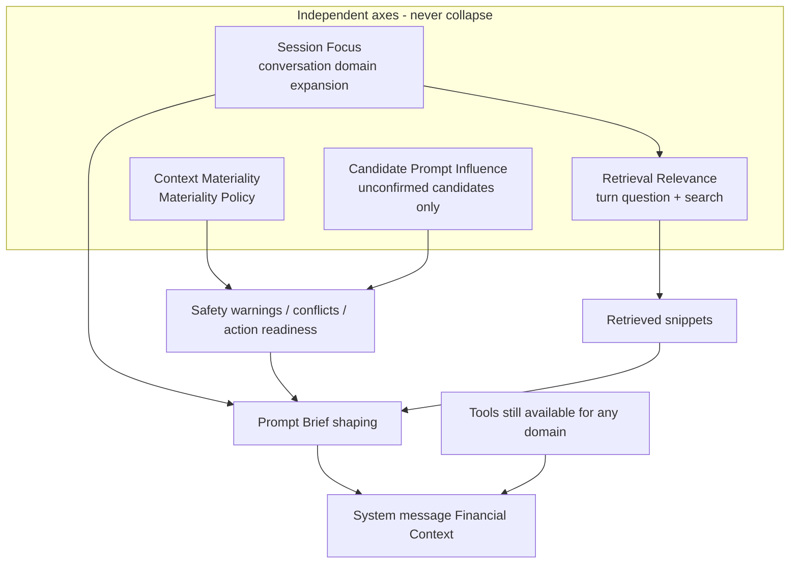

# Copilot Session Focus & Context Priority

| Field | Value |
| --- | --- |
| **Title** | Copilot Session Focus & Context Priority |
| **Author** | TBD (product + eng review) |
| **Date** | 2026-07-09 |
| **Status** | Approved for implementation |
| **Revision** | r6 — open-question resolution (pin prefixes lenient; retrieval boost flag default on) |
| **Intended path (when approved)** | `docs/COPILOT_SESSION_FOCUS_DESIGN_2026-07-09.md` |
| **Related** | `CONTEXT.md`, `docs/CONTEXT_INTELLIGENCE_IMPLEMENTATION_PLAN_2026-05-07.md`, ADRs 0001–0004; proposed ADR 0005 |

---

## Overview

BuildWealth Copilot currently overloads the LLM with personal financial context. On every chat turn, `POST /api/copilot/chat` assembles a full structured package (profile, portfolio snapshot, plan, recommendations, research, retrieval, conflicts, and trace) and injects it as pretty-printed JSON into the system message. When a user has filled out budget, balances, goals, investments, debts, tax profile, and plan assumptions, high-salience numbers compete for attention even when the user only wants to discuss goals or contribution pace.

This design introduces **Session Focus** as a conversation-scoped steering layer that is explicitly separate from **Context Materiality** (safety / impact policy), **Candidate Prompt Influence** (how unconfirmed candidates may shape advice), and **Retrieval Relevance** (turn-level evidence matching). The system prompt uses a slim **Prompt Brief**; deep detail remains available via tools; muted domains can still surface short high/critical materiality warnings.

---

## Background & Motivation

### Current chat path (verified)

1. **Endpoint**: `POST /api/copilot/chat` in  
   `services/orchestrator/src/buildwealth_orchestrator/main.py` (~21940).
2. **Assembly first, conversation later (critical lifecycle fact)**:
   - Today assembly runs **before** `FinancialCopilot.chat`.
   - Conversation is created only inside `FinancialCopilot.chat` via `ConversationStore.get_or_create` (`copilot_runtime.py` ~337–340).
   - There is **no** other create call site. First-message turns have `conversation_id=None`.
   - Therefore any design that “loads stored focus before assembly” **requires a control-flow change** in `copilot_chat` (see [Chat control flow redesign](#chat-control-flow-redesign-required)).
3. **Prompt injection**:
   ```python
   contextual_brief = json.dumps(assembled_context, indent=2, default=str)
   # FinancialCopilot._build_messages:
   f"{self.system_prompt}\n\nFinancial Context:\n{contextual_brief}"
   ```
4. **Structured package builder**: `build_buildwealth_context_payload` always builds a full multi-domain payload before optional light shaping via `shape_context_payload`.
5. **Intent**: `classify_context_intent` filters **registry retrieval domains** only; does not shrink structured package sections. Intent domains are only among `profile | plan | recommendation | research` — **never `portfolio`**.
6. **Materiality in ranking**: `_score_context_item` weights materiality at ~4% (semantic) or ~6% (lexical). Search APIs have **no materiality filter** — only domains, plan_id, symbols, entity_types, recommendation_status, field_path.
7. **Context Trace**: assembler writes `trace`; chat persists on assistant metadata; v2 renders via `web-v2/views/copilot/thread.js`.
8. **Dead path**: `build_contextual_brief` in `main.py` still `json.dumps`s a non-assembled payload and appears unused — delete or rewire in PR1 cleanup.

### Detail-level inconsistency (verified)

| Layer | Default / behavior |
| --- | --- |
| `CopilotContextOptions.detail_level` (request) | `"light"` (`schemas.py` ~1742) |
| `CopilotContextScope.detail_level` (response scope field) | `"full"` (`schemas.py` ~1755) — response model default only; `shape_context_payload` sets `scope.detail_level` from the resolved request level |
| `buildwealth_context.DEFAULT_CONTEXT_DETAIL_LEVEL` | `"full"` |
| Classic web UI `web/views/copilot.js` | sends `"light"` |
| **v2 UI `web-v2/views/copilot.js` `sendMessage`** | **hardcodes `{ detail_level: 'full' }`** |
| `get_buildwealth_context` tool handler | `include_research=True`, `include_plan_projection=True`, `detail_level` via `normalize_context_detail_level` → currently falls through to `"full"` |
| Chat brief | dumps **entire** assembled payload regardless of light shaping |

**PR2 nuance**: when changing defaults, update request path + `DEFAULT_CONTEXT_DETAIL_LEVEL` + tool handler defaults. Do **not** force `CopilotContextScope.detail_level` schema default to light if that breaks response validation for historical fixtures — the shaped payload must set `scope.detail_level` from the actual request (already done in `shape_context_payload`). Prefer aligning the response schema default to `"light"` in the same PR for consistency, with tests updated.

### Existing session steering (primitive)

| Mechanism | Where | Limitation |
| --- | --- | --- |
| Plan picker | v2 masthead `ui.planId` | Scopes plan_id only |
| Inbox / Research / Plan / Today links | `#copilot?focus=...&intent=...` | Prefills draft prompt; no durable focus metadata |
| Setup prompts | GOAL/DEBT/TAX/… in `copilot.js` | Hardcoded “Focus only on …” in user text |
| Conversation store | JSON under conversation dir | `{id, title, created_at, updated_at, messages}` — **no focus field** |

### Pain points

- **Attention pollution**: model fixates on high-salience numbers outside the user’s topic.
- **Prompt token cost** (primary): full JSON brief every turn grows with profile completeness. **Server CPU/IO for full package build remains** until PR4+ can skip unneeded research/projection; PR1 does **not** claim end-to-end API latency wins without measurement — only lower LLM input tokens and better attention.
- **Weak steerability**: no durable conversation focus.
- **Safety risk if naively fixed**: muting must not hide material conflicts.

### Product principles (requirements)

Separate axes (do not collapse):

1. **Context Materiality** — impact if wrong/ignored. Deterministic Materiality Policy. **Not** user-weighted.
2. **Candidate Prompt Influence** — how much an *unconfirmed Context Candidate* may shape answers (`none` … `authoritative_after_apply`). Orthogonal to Session Focus.
3. **Session Focus** — which *domains/sections* this conversation expands, orders, or mutes in the Prompt Brief and retrieval ordering.
4. **Retrieval Relevance** — matches this turn’s question.

**Non-collision rule**: Session Focus never lowers materiality, never changes candidate lifecycle, never changes Candidate Prompt Influence, and never fully suppresses required safety surfaces. Materiality + Candidate Prompt Influence govern *whether* an item/candidate may shape advice; Session Focus governs *which domains are expanded by default* in the brief.

Do **not**: user materiality weights; “memory weights” language; auto-mutate Canonical State; silence high/critical safety when muted.

Do: slim Prompt Brief; default light; intent/focus-shaped packages; conversation focus + chips; tools for deep detail; Context Trace audit.

---

## Goals & Non-Goals

### Goals

1. Reduce default **system-message token volume** while preserving answer quality for focused questions.
2. Give users editable **Session Focus** (primary / secondary / muted domains, pins, priority note, mode).
3. Seed focus from all known v2 entry surfaces.
4. Keep Materiality Policy authoritative; muted domains emit short safety warnings when required.
5. Make focus, detail level, shaping, and safety visible in Context Trace.
6. Ship incrementally with clear PR acceptance boundaries (no half-baked focus UI).

### Non-Goals

- Profile-aware materiality overrides (future).
- User-editable materiality or free-form importance sliders.
- Cross-conversation durable preference memory that rewrites Canonical State.
- Replacing tools / Context Registry with a mega-prompt.
- Classic/v1 UI work (ADR 0004).
- Server-side full package cost elimination in PR1 (deferred to PR4+ selective builder options).

---

## Proposed Design

### Conceptual model: axes (including Candidate Prompt Influence)



### Chat control flow redesign (required)

**Today (broken for pre-assembly focus):**

```text
copilot_chat:
  assemble_context(question, …)          # no conversation / focus yet
  brief = json.dumps(assembled)
  FinancialCopilot.chat(conversation_id) # get_or_create happens HERE
```

**Required target flow (PR3 control-flow change; depends on PR1 brief builder existing):**

```text
copilot_chat:
  1. conversation = store.get_or_create(request.conversation_id, request.question)
     # creates empty conversation on first message BEFORE assembly
  2. stored_focus = normalize_focus(conversation.get("focus"))
  3. nl_patch = parse_session_focus_utterance(request.question)  # optional, PR6; no-op until then
  4. resolved_focus = resolve_turn_focus(
         stored=stored_focus,
         request_focus=request.focus,      # UI chips win
         nl_patch=nl_patch,                 # only if request.focus is None
         set_by_request=...
     )
  5. if request.persist_focus (default True) and resolved_focus differs from stored:
         store.update_focus(conversation["id"], resolved_focus)
         conversation["focus"] = resolved_focus
  6. assembled = assemble_copilot_context_payload(..., focus=resolved_focus, ...)
  7. brief = build_copilot_prompt_brief(assembled, focus=resolved_focus)  # compact JSON
  8. result = FinancialCopilot.chat(
         question=...,
         conversation=conversation,   # NEW: pass preloaded doc; skip get_or_create
         contextual_brief=brief,
         context_trace=assembled["trace"],
         conversation_store=store,
     )
  9. set ContextVar current_copilot_conversation_id for tool loop (PR6)
 10. return CopilotChatResponse(..., focus=normalize_focus(conversation["id"] read-back))
```

#### `FinancialCopilot.chat` API change

```python
async def chat(
    self,
    question: str,
    conversation_id: str | None = None,
    *,
    conversation: dict[str, Any] | None = None,  # if set, use as-is (already get_or_create'd)
    contextual_brief: str,
    context_trace: dict[str, Any] | None = None,
    conversation_store: ConversationStore | None = None,
) -> dict[str, Any]:
    store = conversation_store or self.conversation_store
    if conversation is None:
        conversation = store.get_or_create(conversation_id, question)
    # else: conversation already loaded/created; do NOT create again
    # append user message, tool loop, append assistant, save
```

**Ordering vs message append**:

| Step | When | Notes |
| --- | --- | --- |
| `get_or_create` | Before assembly | Ensures `conversation["id"]` exists for focus write |
| `update_focus` if `persist_focus` | After resolve, **before** assembly | First-message entry seeds land on the new doc |
| Append user message | Inside `chat`, after brief exists | Unchanged |
| Tool `set_session_focus` | Mid-loop | Updates durable focus for **next** turns only; does **not** re-inject system brief this turn |

**Risk**: first-message title uses `first_user_message` at create time — same as today. If create moves earlier, title behavior is unchanged.

### End-to-end sequence (corrected)

```mermaid
sequenceDiagram
  participant UI as v2 Copilot UI
  participant API as POST /api/copilot/chat
  participant Store as ConversationStore
  participant Asm as ContextAssembler
  participant Brief as PromptBriefBuilder
  participant Copilot as FinancialCopilot

  UI->>API: question, conversation_id?, plan_id, focus?, context_options
  API->>Store: get_or_create(conversation_id, question)
  API->>API: resolve_turn_focus(stored, request.focus, nl_patch)
  API->>Store: update_focus if persist_focus
  API->>Asm: assemble(question, plan_id, resolved_focus, detail_level)
  Asm->>Asm: merge_focus_with_intent, shape package, retrieve, safety warnings
  Asm->>Brief: build_copilot_prompt_brief
  Brief-->>API: compact brief + trace.focus_applied
  API->>Copilot: chat(conversation=doc, brief, trace)
  Note over Copilot: append messages; tools may update focus for NEXT turn
  Copilot-->>API: answer, tool_calls, context_trace
  API-->>UI: answer + context_trace + focus
```

---

### Focus domain catalog (single source of truth)

Define `FOCUS_DOMAIN_CATALOG` in Python (e.g. `services/session_focus.py` or `buildwealth_context.py`). web-v2 **mirrors** the same id list (static copy or generated snapshot in PR5). Server is authoritative on write validation.

| focus_domain_id | User label | registry_domains | package paths include (when primary/secondary) | package paths counts-only / omit when not focused | preferred_tools |
| --- | --- | --- | --- | --- | --- |
| `profile` | Profile | `["profile"]` | See parent rule below | — | `get_financial_profile`, onboarding tools |
| `profile.goals` | Goals | `["profile"]` | `financial_picture.financial_profile.goal_items` (list or light list) | counts only when parent light without this child | profile draft tools |
| `profile.cashflow` | Income & expenses | `["profile"]` | `…income_items`, `…expense_items` | counts only otherwise | profile, `assess_affordability` |
| `profile.debt` | Debt | `["profile"]` | `…debt_items`, `…flags.no_debt` | counts only otherwise | profile tools |
| `profile.tax` | Tax profile | `["profile"]` | `…tax_profile` (object) | `{}` or omit when muted | `compute_tax`, profile tools |
| `profile.policy` | Investment policy | `["profile"]` | `…investment_policy` | `{}` or omit when muted | profile tools |
| `portfolio` | Portfolio | `["portfolio"]` if indexed else structured-only | `financial_picture.snapshot_summary`, light allocation cues in summary | omit holdings series | balances, allocation, health |
| `portfolio.holdings` | Holdings | `["portfolio"]` | holdings-related fields if present in package; else tool-only | omit holdings detail | allocation, `simulate_trade` |
| `plan` | Plan | `["plan"]` | `planning.active_plan` (light), `planning.tracking`, contribution summary, baseline scenarios light | omit full `plan_context` markdown unless primary+full | `get_plan_review_context`, scenario tools |
| `recommendation` | Inbox | `["recommendation"]` | `decisions.recommendations` top N light | open_count only | list/preview recommendation |
| `research` | Research | `["research"]` | `research.items` light, watchlist symbols_preview | omit items | `research_*` tools |

#### Parent `profile` vs children

| Focus state | Behavior |
| --- | --- |
| Primary/secondary **`profile`** (no children listed) | Light profile package **as today** in `shape_context_payload` light mode: array **counts** for income/expense/debt/goals/physical_assets; **inline** `tax_profile`, `investment_policy`, `flags` (current light behavior). |
| Primary **`profile.goals`** only | Expand `goal_items` (full list or capped list of 10); other arrays stay counts; tax/policy stay light-inline unless muted. |
| Primary **`profile`** + primary **`profile.goals`** | Union: light parent base + expanded goals. |
| Muted **`profile.tax`** | Force `tax_profile` → `{}` or omit in `focused_structured` even if light parent would inline it; still eligible for safety warning if materiality/conflict requires. |
| Muted **`profile`** | Strip all profile expansions from brief; keep counts in prose `summary` only if already in summary string; safety still applies. |

#### Registry mapping helper

```python
def focus_domains_to_registry_domains(focus_domains: list[str]) -> list[str]:
    # profile.goals -> profile; portfolio.holdings -> portfolio; plan -> plan; etc.
```

Portfolio enters retrieval only via **explicit Session Focus** (or structured snapshot sections), not via `classify_context_intent` (which never emits `portfolio`).

---

### Session Focus data model

Stored on conversation document:

```json
{
  "id": "…",
  "title": "…",
  "created_at": "…",
  "updated_at": "…",
  "focus": {
    "mode": "narrow",
    "primary_domains": ["plan", "profile.goals"],
    "secondary_domains": ["recommendation"],
    "muted_domains": ["research", "portfolio.holdings"],
    "pinned_entity_ids": ["recommendation:rec-…", "goal:…"],
    "priority_note": "User is prioritizing retirement contribution pace this month.",
    "set_by": "user",
    "updated_at": "2026-07-09T12:00:00+00:00",
    "schema_version": 1
  },
  "messages": []
}
```

| Field | Rules |
| --- | --- |
| `mode` | `narrow` \| `balanced` \| `wide` |
| `primary_domains` | 0–3, catalog members, unique, ordered |
| `secondary_domains` | 0–5, catalog members, unique |
| `muted_domains` | 0–8, catalog members, unique |
| `pinned_entity_ids` | 0–12; prefer prefixes `recommendation:`, `goal:`, `symbol:`, `plan:`, `artifact:` |
| `priority_note` | ≤ 280 chars; untrusted text; never Canonical State |
| `set_by` | `user` \| `entry_surface` \| `planner` \| `default` |
| `schema_version` | 1 |

**List conflict resolution (normalize)** — use `covers_focus_domain` / `list_covers` (see merge section), not exact string equality only.

**Precedence law (v1, non-negotiable for PR4 goldens):**

| Conflict | Winner | Effect |
| --- | --- | --- |
| **User/request primary** vs muted | **User primary wins** | Drop conflicting muted ids (coverage-aware) |
| **Intent-derived** primary/secondary vs **user muted** | **User mute wins** | Strip muted domains from primary/secondary; mute list keeps the user mute |
| Secondary vs primary | Primary wins | Drop secondary entries covered by primary |
| Secondary vs muted | Muted wins | Drop secondary entries covered by muted |

Normalize steps (API write path for stored focus always treats lists as **user-specified** — primary wins over mute on the document):

1. Dedupe each list preserving order.
2. Drop unknown domain ids (write API → 400; read path → drop + trace warning).
3. **User-primary path only** (PATCH focus / chat `request.focus` with non-empty primary): if a muted domain covers or is covered by any **user** primary domain → **keep primary, remove that muted id**.
4. If secondary domain is covered by muted → **keep muted, remove from secondary**.
5. If secondary domain is covered by primary → keep primary, remove from secondary.
6. Clamp lengths.

Turn-time `merge_focus_with_intent` applies the full precedence law (including mute-over-intent); see algorithm below. Do **not** call a single “primary always wins” normalizer on intent-filled primary.

**Default focus** (missing field):

```python
DEFAULT_FOCUS = SessionFocus(
    mode="balanced",
    primary_domains=[],
    secondary_domains=[],
    muted_domains=[],
    pinned_entity_ids=[],
    priority_note="",
    set_by="default",
    updated_at=None,
    schema_version=1,
)
```

Empty primary/secondary means “derive from intent each turn” via `merge_focus_with_intent`.

---

### `merge_focus_with_intent` (pure function)

```python
@dataclass(frozen=True)
class EffectiveFocus:
    mode: str
    primary_domains: tuple[str, ...]      # focus catalog ids
    secondary_domains: tuple[str, ...]
    muted_domains: tuple[str, ...]
    pinned_entity_ids: tuple[str, ...]
    priority_note: str
    set_by: str
    retrieval_registry_domains: tuple[str, ...]  # top-level registry domains for search
    # note: no safety_always domain list — safety is warning collection, not domain expansion
```

#### Parent/child coverage helper (required)

Product rule **(B)** — not exact-id-only. Catalog ids form a small tree (`profile` parent of `profile.*`, `portfolio` parent of `portfolio.*`). Use this for list membership, secondary exclusion, and mute/primary conflicts:

```python
def covers_focus_domain(holder: str, candidate: str) -> bool:
    """True if holder already covers candidate for list-dedup purposes."""
    if holder == candidate:
        return True
    # Parent covers children: profile covers profile.goals, etc.
    if candidate.startswith(holder + "."):
        return True
    # Child does not cover sibling children; child does cover bare parent when
    # deciding whether intent top-level "profile" is redundant given profile.goals:
    if holder.startswith(candidate + "."):
        return True
    return False

def list_covers(domains: list[str], candidate: str) -> bool:
    return any(covers_focus_domain(d, candidate) for d in domains)
```

Examples: `list_covers(["profile.goals"], "profile")` → True; `list_covers(["profile"], "profile.goals")` → True; `list_covers(["profile.goals"], "profile.tax")` → False.

When building secondary from intent, **exclude** any intent domain already covered by primary (so bare `profile` is dropped when primary has `profile.goals`).

**v1 mute coverage for “is this domain muted?”**: a domain `d` is muted if `list_covers(user_muted, d)` — muting `profile` mutes all `profile.*`; muting `profile.tax` does **not** mute `profile.goals`.

**Mute vs primary resolution** (do not use blanket “primary wins”):

- If primary came from **user/request** (`user_primary` non-empty): user primary wins → drop muted ids that cover or are covered by any user primary domain.
- If primary came from **intent** (`user_primary` empty): user mute wins → strip primary/secondary entries covered by `user_muted`; **keep** those mutes.

#### Pin prefix → focus domain (`pinned_focus_domains`)

```python
PIN_PREFIX_TO_FOCUS_DOMAIN: dict[str, str] = {
    "recommendation": "recommendation",
    "goal": "profile.goals",
    "symbol": "research",          # research-fit pins; not portfolio.holdings
    "plan": "plan",
    "artifact": "plan",
    "holding": "portfolio.holdings",  # optional prefix if UI adds it later
    "candidate": "profile",        # context-candidate default; refine via entry seed when known
}

def pinned_focus_domains(pinned_entity_ids: list[str]) -> set[str]:
    """Map pin ids like 'recommendation:rec-1' / 'symbol:AAPL' to catalog domains."""
    out: set[str] = set()
    for raw in pinned_entity_ids:
        text = str(raw or "").strip()
        if not text or ":" not in text:
            continue  # unknown shape → no domain allowance (entity still boostable by id match)
        prefix, _, _rest = text.partition(":")
        domain = PIN_PREFIX_TO_FOCUS_DOMAIN.get(prefix.lower())
        if domain:
            out.add(domain)
    return out
```

| Pin example | Focus domain(s) allowed for narrow mode | Notes |
| --- | --- | --- |
| `recommendation:rec-…` | `recommendation` | |
| `goal:…` | `profile.goals` | |
| `symbol:AAPL` | `research` | Holdings detail still tool-only unless `holding:` pin |
| `holding:…` | `portfolio.holdings` | Optional; not required in v1 UI |
| `plan:…` / `artifact:…` | `plan` | |
| `candidate:…` | `profile` | Entry surface may override primary |
| no prefix / unknown prefix | _(none)_ | Pin still forces **entity-id include** in retrieval budget (PR4 scoring); no domain added to allow-list or retrieval_registry |

**Pin effects (v1, all three):**

1. Narrow auto-mute **allow-list** (domain not auto-muted).
2. **`retrieval_registry_domains`** includes mapped pin domains (union with primary+secondary).
3. Retrieval **entity-id force-include** / score pin multiplier for the specific id.

If a pin domain is also in `user_muted`, pin still contributes to (1)–(3) for that turn (pin is an explicit “keep this entity in scope”); the mute continues to suppress unrelated expansion of that domain in package shaping where applicable. Prefer UI not offering mute+pin of the same domain.

Unit-test `pinned_focus_domains` and `covers_focus_domain` in PR4.

#### Algorithm

```text
function merge_focus_with_intent(focus, intent) -> EffectiveFocus:
  mode = focus.mode or "balanced"
  intent_domains = intent.domains  # e.g. ["plan","profile","recommendation","research"]
  # Map intent top-level -> focus catalog ids (identity for plan/profile/recommendation/research)
  n = 1 if intent.confidence == "high" else 2

  user_primary = list(focus.primary_domains)      # empty => intent-derived primary
  user_secondary = list(focus.secondary_domains)  # empty => intent-derived secondary
  user_muted = list(focus.muted_domains)          # always treated as user/request mutes
  primary_from_user = len(user_primary) > 0

  # --- 1. Choose primary source ---
  if primary_from_user:
    primary = user_primary[:3]
  else:
    primary = intent_domains[:n]

  # --- 2. Choose secondary source ---
  # Product rule (narrow chips mean “only these domains”):
  # when mode=narrow AND user set primary AND user left secondary empty,
  # do NOT intent-widen secondary. Balanced/wide still intent-fill (Example 2).
  if user_secondary:
    secondary = [d for d in user_secondary if not list_covers(primary, d)][:5]
  elif mode == "narrow" and primary_from_user:
    secondary = []
  else:
    secondary = [d for d in intent_domains if not list_covers(primary, d)][:5]

  muted = list(user_muted)
  pin_domains = pinned_focus_domains(focus.pinned_entity_ids)

  # --- 3. Precedence: mute vs primary (THE critical branch) ---
  if primary_from_user:
    # User primary wins over mute: drop muted ids that conflict with user primary
    muted = [
      m for m in muted
      if not list_covers(primary, m) and not any(covers_focus_domain(m, p) for p in primary)
    ]
  else:
    # User mute wins over intent-derived primary: strip primary, KEEP muted
    primary = [d for d in primary if not list_covers(muted, d)]
    if not primary:
      # Refill from intent domains not covered by mute (still intent-derived → mute wins)
      primary = [d for d in intent_domains if not list_covers(muted, d)][:n]

  # --- 4. Secondary always loses to mute and to primary (coverage-aware) ---
  # User-specified secondary also loses to user mute (mute is an explicit “don’t expand”).
  secondary = [
    d for d in secondary
    if not list_covers(primary, d) and not list_covers(muted, d)
  ][:5]

  # --- 5. Mode narrow auto-mute (after precedence, so user primary already cleared mute conflicts) ---
  if mode == "narrow":
    allowed = set(primary) | set(secondary) | set(pin_domains)
    for d in FOCUS_DOMAIN_CATALOG:
      if list_covers(list(muted), d):
        continue
      if any(covers_focus_domain(a, d) for a in allowed):
        continue
      muted.append(d)
  # balanced / wide: no auto-mute beyond remaining user mutes after step 3

  # --- 6. Dedupe / clamp ---
  primary = unique_preserve(primary)[:3]
  secondary = unique_preserve(secondary)[:5]
  muted = unique_preserve(muted)  # narrow may add many catalog ids

  # Pins contribute mapped domains to registry retrieval (not only entity force-include)
  retrieval_registry_domains = unique(
    focus_domains_to_registry_domains(primary + secondary + list(pin_domains))
  )
  # Portfolio never appears in retrieval_registry unless primary/secondary/pins include portfolio*

  return EffectiveFocus(...)
```

**Do not** run a post-pass that drops user mutes whenever primary (including intent-filled) overlaps them. That was the r3 bug that broke Examples 3a/3b.

**Secondary intent-fill summary:**

| mode | user_primary | user_secondary | secondary result |
| --- | --- | --- | --- |
| any | any | non-empty | user secondary (minus primary/mute) |
| **narrow** | **non-empty** | **empty** | **`[]` — no intent widen** (Examples 4/4b) |
| balanced / wide | non-empty | empty | intent-fill minus primary/mute (Example 2, 3c, 6) |
| any | empty | empty | intent-fill minus primary/mute (Examples 1, 3a, 3b, 5) |
| narrow | empty | empty | intent-fill (intent-driven narrow; not in golden table) |

#### Worked examples (golden tests for PR4)

Assume planning intent confidence = **medium** (`n=2`) unless noted. investment_fit with symbols = **high** (`n=1`) unless noted.

Walk each row against the algorithm (source of primary, secondary fill rule, mute precedence, pins→retrieval).

| # | focus (abbrev) | intent | effective primary | secondary | muted | retrieval_registry |
| --- | --- | --- | --- | --- | --- | --- |
| 1 | default empty, mode=balanced | planning medium: [plan, profile, recommendation, research] | [plan, profile] (intent n=2) | intent-fill [recommendation, research] | [] | plan, profile, recommendation, research |
| 2 | **user** primary=[profile.goals], mute=[research], mode=**balanced**, user_secondary=[] | planning medium | [profile.goals] | intent-fill → [plan, recommendation] (bare profile covered; research muted) | [research] | profile, plan, recommendation |
| 3a | empty user primary, mute=[research], mode=balanced | investment_fit **high** n=1: [research, plan, profile, recommendation] | mute wins → strip research → refill **[plan]** | [profile, recommendation] | **[research]** kept | plan, profile, recommendation |
| 3b | empty user primary, mute=[research], mode=balanced | investment_fit **medium** n=2 | strip research from [research, plan] → **[plan]** | [profile, recommendation] | **[research]** kept | plan, profile, recommendation |
| 3c | **user** primary=[research], mute=[research], mode=balanced | investment_fit high | **[research]** user primary wins | intent-fill [plan, profile, recommendation] | **[]** mute cleared for research | research, plan, profile, recommendation |
| 4 | mode=**narrow**, **user** primary=[plan], user_secondary=[], pins=[] | general medium | [plan] | **[]** (narrow+user primary; no intent widen) | all catalog ids not covered by plan (profile, profile.*, portfolio*, recommendation, research, …) | **plan** only |
| 4b | mode=**narrow**, **user** primary=[plan], pin=`recommendation:rec-1`, user_secondary=[] | general | [plan] | **[]** | all except plan + **recommendation** (pin in allow-list) | **plan, recommendation** (pin domain union) |
| 5 | mode=wide, mute=[portfolio.holdings], empty user primary | planning medium | [plan, profile] | [recommendation, research] | [portfolio.holdings] only | plan, profile, recommendation, research |
| 6 | **user** primary=[portfolio], mode=balanced, user_secondary=[] | planning medium | [portfolio] | intent-fill [plan, profile, recommendation, research] | [] | portfolio, plan, profile, recommendation, research |

**Example 2** — normative for parent/child coverage **and** balanced empty-secondary intent-fill.

**Examples 3a/3b** — normative for **user mute wins over intent-derived primary**.

**Example 3c** — normative for **user primary wins over mute**.

**Examples 4 / 4b** — normative for **narrow + user primary → secondary stays empty** and **pins join `retrieval_registry_domains`**.

**Example 3a vs 3b** — always record `intent.confidence` in fixtures; high-confidence investment_fit uses `n=1`.

**Wide mode**: summary-first Prompt Brief always; larger retrieval budget (12 items / 6000 chars); `focused_structured` includes light sections for all non-muted catalog domains that have package mappings; still **no** full JSON dump of assembly/trace/cache.

---

### Prompt brief builder

Introduce `build_copilot_prompt_brief(assembled_context, *, focus, effective_focus) -> str`.

**Production serialization (required)**:

```python
json.dumps(brief_dict, default=str, separators=(",", ":"), ensure_ascii=False)
```

No indent on the chat path.

#### Brief skeleton

```json
{
  "brief_version": "copilot_prompt_brief_v1",
  "session_focus": { "...effective or stored focus..." },
  "intent": { "intent": "…", "confidence": "…", "domains": [] },
  "summary": "…",
  "quality": {
    "coverage_score_pct": 0,
    "snapshot_stale": false,
    "warning_count": 0
  },
  "scope": { "plan_id": null, "detail_level": "light", "use_live_snapshot": false },
  "focused_structured": {},
  "retrieved_context": { "items": [] },
  "citations": [],
  "conflicts": [],
  "safety_warnings": [],
  "context_budget": { "truncated": false, "returned_items": 0 },
  "tool_guidance": {
    "deep_detail": "Call domain tools or get_buildwealth_context with only the flags you need (default light, research/projection off unless required).",
    "search": "Call search_context with domain filters."
  }
}
```

**PR1 field compatibility**: keep both `conflicts` (compact array, same shape as assembler conflicts[:5] plain-language fields) **and** `safety_warnings` (unified list including quality/muted). This avoids a hard break if the model still looks for `conflicts`. Full assembler `trace` / cache / registry status are **omitted** from the brief (remain on HTTP response `context_trace` for UI).

#### Deterministic truncation algorithm

Constants:

```python
BRIEF_HARD_MAX_CHARS = 15_000
FOCUSED_STRUCTURED_HARD_MAX_CHARS = 12_000
RETRIEVED_TEXT_CHARS = { "narrow": 4000, "balanced": 6000, "wide": 6000 }
RETRIEVED_MAX_ITEMS = { "narrow": 8, "balanced": 12, "wide": 12 }
MAX_CITATIONS = 12
MAX_SAFETY_WARNINGS = 5  # never drop below materiality-critical set if ≤5
```

After building the dict, `serialize` and if `len(serialized) > BRIEF_HARD_MAX_CHARS`, apply steps **in order**, re-serializing after each step until under budget or steps exhausted:

| Priority | Action | Never do |
| --- | --- | --- |
| 0 | (invariant) Do not remove `safety_warnings`, `session_focus`, `tool_guidance`, `quality.snapshot_stale`, `brief_version`, `scope.plan_id` | — |
| 1 | Shrink each `retrieved_context.items[].text` via budget (same pattern as `_budget_retrieved_items`) | Drop all retrieved items before text shrink |
| 2 | Drop `retrieved_context.items` beyond half of mode max | — |
| 3 | Remove `focused_structured` keys in reverse priority: research → watchlist → baseline_projection → timeline → secondary profile arrays → keep primary domain paths last | Strip primary domain paths before secondary |
| 4 | Truncate `citations` to 3 | — |
| 5 | Truncate `summary` to 1200 chars | — |
| 6 | Replace remaining oversized blobs with `{"omitted": true, "reason": "brief_budget"}` | Replace `safety_warnings` |
| 7 | Set `brief_truncated: true` on sibling field in brief + `trace.focus_applied.brief_truncated` | — |

If still over budget after step 6, keep safety_warnings + session_focus + summary(800) + tool_guidance only.

**PR1 fat-profile fixture**: unit test loads a large assembled fixture (or synthesizes one) and asserts `len(brief) < BRIEF_HARD_MAX_CHARS` and `safety_warnings` preserved when present.

#### Explicitly omit from brief

Full financial_profile arrays (unless focused), full recommendation bodies, full plan_context markdown, full today_dashboard, assembler `trace.registry`, cache telemetry.

---

### Muted-domain safety (implementable contract)

**v1 primary sources** (no new search API required):

1. Assembler `conflicts` (already materiality-aware / blocking).
2. `trace.context_warnings` / quality freshness (stale snapshot).
3. Structured package signals: open `high` priority recommendations count; profile flags; onboarding not ready when user asks action-style questions.

**Optional enhancement (PR4+)**: secondary registry search on muted registry domains with small limit (e.g. 5), then **post-filter** `item.materiality in {"high","critical"}` in Python. Do **not** require materiality as a search parameter.

#### Pure function

```python
def collect_muted_safety_warnings(
    *,
    structured_context: Mapping[str, Any],
    conflicts: Sequence[Mapping[str, Any]],
    quality: Mapping[str, Any] | None,
    effective_focus: EffectiveFocus,
    question: str,
    muted_registry_candidates: Sequence[Mapping[str, Any]] = (),  # optional post-filtered
) -> list[dict[str, Any]]:
    ...
```

Each warning object:

```python
{
  "domain": "profile.tax",  # focus domain id or "quality" / "conflict"
  "materiality": "high",
  "action_readiness": "Review before relying on this",
  "message": "… plain language ≤ 220 chars …",
  "blocks_decision_grade_advice": True,
  "source": "conflict" | "quality" | "structured_signal" | "muted_registry_postfilter",
}
```

#### Trigger table (v1 exhaustive)

| source | condition | warning template (plain language) | blocks_decision_grade_advice |
| --- | --- | --- | --- |
| conflict | any conflict with `blocks_decision_grade_advice=true` | use `plain_language` or `title` | true |
| conflict | severity in {high, critical} even if not blocking | use plain_language | false unless flag set |
| quality | `snapshot_stale is true` | “Portfolio snapshot is stale; run sync or use live snapshot before relying on balances.” | false (caveat, not always hard block) |
| structured_signal | `wants_action_advice(question)` AND open high_priority recommendations ≥ 1 AND `recommendation` in effective muted | “{n} high-priority inbox items exist; unmute Inbox focus or call list_recommendations.” | false |
| structured_signal | tax_profile empty/missing critical fields AND giving tax/contribution advice intent | “Tax profile needs review before decision-grade tax or contribution advice.” | true when planning/tax intent |
| muted_registry_postfilter (optional) | candidate materiality high/critical, domain muted, not already covered | trim item text to one sentence | true if materiality critical |

#### `wants_action_advice(question)` (deterministic)

Reuse recommendation-intent keyword set from `classify_context_intent` (`should i`, `what should`, `next action`, …) **OR** intent == `recommendation_review`. Not always-on for high-priority inbox counts (avoids noise on pure research questions).

**Mute does not delete conflicts** from this collector. Package shaping may omit domain dumps; warnings still emit.

---

### ContextAssembler + retrieval

#### Inputs

```python
async def assemble_context(..., focus: Mapping | None = None, detail_level: str = "light"):
```

Pipeline: intent → `merge_focus_with_intent` → shape package for focus → retrieve with domain filter + score boost → conflicts → `collect_muted_safety_warnings` → `trace.focus_applied`.

Bump `CONTEXT_ASSEMBLER_VERSION` → `context_intelligence_assembler_v2` in **PR4** (when focus effects land). PR3 may leave v1 and set `focus_applied.effect = "stored_only"` without version bump, or add optional field without version change.

#### Retrieval score boost (single formula)

**Default on.** Controlled by a settings/env feature flag so A/B or emergency rollback can disable boost without reverting PR4 (domain filter, package shaping, and safety collector stay active). When the flag is off, use `mult = 1.0` (identity) and set `trace.focus_applied.retrieval_focus_boost = false`.

Suggested flag (name may match repo conventions): `COPILOT_RETRIEVAL_FOCUS_BOOST` / settings `retrieval_focus_boost: bool = True`.

```python
FOCUS_MULTIPLIER = {
    "primary": 1.25,
    "secondary": 1.10,
    "muted": 0.55,
    "pinned": 1.35,
    "none": 1.0,
}

pre_boost = base_score  # existing total_score from _score_context_item
if retrieval_focus_boost_enabled:  # settings/env; default True
    mult = FOCUS_MULTIPLIER[tier]  # tier from domain mapping + pin match (pin wins max mult)
    score = min(1.0, pre_boost * mult)
else:
    mult = 1.0
    score = pre_boost
# score_breakdown["focus"] = mult
# score_breakdown["pre_focus_score"] = pre_boost
```

Materiality coefficients **unchanged** (0.04 / 0.06).

Muted items can still be collected for optional safety post-filter; they are deprioritized for brief inclusion.

#### Retrieval domain filter

Primary search: `domains=effective.retrieval_registry_domains` (from merge).  
No materiality filter in SQL/search API.

**Plan-scoped second pass** (replaces today’s unconditional `if plan_id` search over `plan|research|recommendation`):

```text
def plan_in_focus(effective) -> bool:
  ids = list(effective.primary_domains) + list(effective.secondary_domains)
  return list_covers(ids, "plan")  # primary/secondary plan or child (none today)

# v1 rule (simple, explicit):
run_plan_id_pass = bool(plan_id) and (
  effective.mode != "narrow" or plan_in_focus(effective)
)
```

| Situation | `run_plan_id_pass` | Rationale |
| --- | --- | --- |
| `plan_id` set, mode balanced/wide | **true** | Preserve today’s masthead plan-scoped enrichment |
| `plan_id` set, mode narrow, plan in primary∪secondary | **true** | User/entry still plan-focused |
| `plan_id` set, mode narrow, primary goals only (no plan) | **false** | Avoid research/recommendation leakage from today’s multi-domain plan_id pass |
| `plan_id` null | **false** | Same as today |

When `run_plan_id_pass` is true, keep current domain list for that pass: `["plan", "research", "recommendation"]` with `plan_id=…`, **except** drop domains that map to **explicitly muted** focus domains after registry mapping (e.g. if `research` muted, pass domains `["plan", "recommendation"]` only). Structured plan package inclusion remains governed by package shaping, not this flag.

**Regression note**: goals-setup entry with masthead `plan_id` still selected + `mode=narrow` will **not** pull plan/research/recommendation registry via the second pass; summary may still mention active plan title from structured scope if shaping allows counts. User can widen mode or add plan to secondary to restore the pass.

---

### Intent → package shaping

`shape_context_payload_for_focus(payload, *, intent, effective_focus, detail_level) -> focused_structured dict`

Composition:

1. Start from **intent base section set** (table below).
2. **Add** primary expansions (subdomain matrix).
3. **Add** secondary light expansions.
4. **Strip** muted paths (never strip safety collector inputs from underlying assembly — only from brief expansion).
5. Apply global light/full: `full` only deepens primary domain paths in focused_structured; still not a full assembly dump.

#### Intent base sections

| Intent | Include at light depth |
| --- | --- |
| `planning_question` | planning active_plan/tracking/contribution/baseline light; profile counts |
| `investment_fit` | research light, snapshot_summary, investment_policy light, related recs light |
| `profile_question` | profile light (+ subdomain if focused), onboarding_status |
| `recommendation_review` | decisions.recommendations light, plan id |
| `general` | summary + snapshot_summary + high-priority rec counts + active plan title |

---

### Focus update precedence (single turn)

For **one** user message / chat request:

1. **`request.focus` from UI chips** (if present) — full authority for that turn; `set_by=user` (or entry_surface if client tags it).
2. Else **deterministic NL patch** from current user message (`parse_session_focus_utterance`) — apply immediately; `set_by=user`; surface chips on response `focus` for undo.
3. Else **stored conversation focus**.
4. **`set_session_focus` tool** — only updates durable store for **subsequent** turns; does not re-assemble current system brief.

**v1 product rule for mutes**: apply immediately, show chips, one-click unmute. **No** confirmation gate in v1. Delete “confirm first” branch from v1 scope.

---

### `set_session_focus` conversation contract (PR6)

**Chosen binding**: ContextVar `current_copilot_conversation_id` set in `copilot_chat` around the tool loop (same pattern as `current_copilot_workspace_services`).

```python
# in copilot_chat after get_or_create:
conv_token = current_copilot_conversation_id.set(conversation["id"])
try:
    ...
finally:
    current_copilot_conversation_id.reset(conv_token)
```

Tool handler:

```python
async def tool_set_session_focus(arguments):
    conversation_id = current_copilot_conversation_id.get()
    if not conversation_id:
        return {"ok": False, "error": "No active conversation for Session Focus update."}
    # validate patch, update_focus(..., set_by="user")
    return {"ok": True, "focus": normalized, "applies_to": "subsequent_turns"}
```

**Mid-turn caveat (required in tool description + system prompt)**:  
> Updates Session Focus for this conversation going forward. It does not re-shape the Financial Context already injected for the current turn. For same-turn steering, the user message is parsed before assembly, or the user adjusts chips before send.

Do **not** require the model to pass `conversation_id` (fragile). Do **not** invent a fake “live re-assembly” behavior.

---

### System prompt updates

#### PR1 — minimal delta (required with brief ship)

Replace/adjust the lines that currently say default chat context includes full `retrieved_context`, `citations`, `conflicts`, `context_budget`, and `trace` (`main.py` ~1177–1179) with:

```
CONTEXT BRIEF:
- Financial Context is a slim Prompt Brief (brief_version=copilot_prompt_brief_v1), not a full Canonical State dump.
- Expect: summary, quality, scope, focused_structured (partial), retrieved_context, citations,
  conflicts (compact), safety_warnings, context_budget (compact), tool_guidance.
- Full package dumps and deep numbers: call get_buildwealth_context (prefer detail_level=light;
  set include_research / include_plan_projection only when needed) or domain-specific tools.
- If safety_warnings or conflicts block decision-grade advice, explain in plain language and do not
  present the advice as ready to act on until resolved.
- Prefer domain tools over get_buildwealth_context when the question is narrow.
```

#### PR6 — Session Focus language

Add Session Focus / mute / `set_session_focus` / priority_note-is-not-Canonical-State rules.

---

### Default detail level & tool lean defaults

| Path | Policy |
| --- | --- |
| v2 chat request | `detail_level: "light"` (remove full hardcode) |
| `DEFAULT_CONTEXT_DETAIL_LEVEL` | change `"full"` → `"light"` |
| `tool_get_buildwealth_context` | defaults: `detail_level=light`, `include_research=False`, `include_plan_projection=False` unless arguments set; update tool description: “request only what you need” |
| Tool payload | existing `_safe_tool_content` 12k cap remains |

This mitigates token rebound when the model calls the unified context tool more often after brief slim-down.

---

### Context Trace: `focus_applied`

#### PR3 (storage only)

```json
{
  "focus_applied": {
    "effect": "stored_only",
    "mode": "balanced",
    "primary_domains": [],
    "secondary_domains": [],
    "muted_domains": [],
    "set_by": "default"
  }
}
```

No claim of brief/retrieval shaping yet.

#### PR4 (full effects)

```json
{
  "focus_applied": {
    "effect": "brief_and_retrieval",
    "mode": "narrow",
    "primary_domains": ["plan"],
    "secondary_domains": ["profile.goals"],
    "muted_domains": ["research"],
    "pinned_entity_ids": [],
    "priority_note": "…",
    "set_by": "user",
    "effective_domains_for_retrieval": ["plan", "profile"],
    "detail_level": "light",
    "brief_version": "copilot_prompt_brief_v1",
    "brief_chars": 8420,
    "brief_truncated": false,
    "safety_warnings_count": 1,
    "muted_safety_surfaced": ["profile.tax"],
    "package_sections_included": ["planning.active_plan", "planning.tracking"],
    "package_sections_omitted": ["research.items"],
    "retrieval_focus_boost": true,
    "score_formula": "min(1.0, pre_boost * focus_multiplier)"
  }
}
```

v2 UI: one-line focus summary in `renderContextTraceSummary`.

---

### Entry-surface seeding (complete vs known v2 links)

Unknown intents → default focus (balanced, empty lists); **no wrong mutes**.

| Entry intent / surface | Seed focus |
| --- | --- |
| `review_plan_assumptions` | primary `[plan]`, secondary `[profile]`, mute `[research]`, set_by=entry_surface |
| `explain_scenario_diff` / `plan-scenario` | primary `[plan]`, secondary `[profile]` |
| `review_stale_assumptions` | primary `[plan]`, secondary `[profile, recommendation]` |
| `explain-chart` | primary `[plan]`, mute `[research]` |
| `withdrawal-strategy` | primary `[plan]`, secondary `[profile.tax, profile.cashflow]` |
| `plan-branch` | primary `[plan]`, secondary `[profile]` |
| `affordability` | primary `[profile.cashflow, portfolio]`, secondary `[plan, profile.debt]` |
| `investment-policy` | primary `[profile.policy]`, mute `[research]` |
| `investment-fit` (+ optional focus=recId) | primary `[research]`, secondary `[portfolio, profile.policy, recommendation]`, pin `recommendation:{id}` |
| `complete-context` (+ focus=recId) | primary `[profile]`, secondary `[recommendation]`, pin rec |
| `review-decision` (+ focus=recId) | primary `[recommendation]`, secondary `[plan]`, pin rec |
| `context-candidate` (+ focus=candidateId) | primary from candidate target_domain if known else `[profile]`, pin candidate id |
| Goal setup card | primary `[profile.goals]`, mute `[research, portfolio.holdings]` |
| Debt setup | primary `[profile.debt]`, mute `[research]` |
| Tax setup | primary `[profile.tax]` |
| Physical asset setup | primary `[profile]` (physical_assets path), mute `[research]` |
| Generic PROFILE_SETUP | primary `[profile]`, mode=narrow-ish mute research |

Prefill prompts remain for tool choreography; domain priority moves into focus metadata.

---

## API / Interface Changes

### Shared catalog + validation

```python
FOCUS_DOMAIN_CATALOG: frozenset[str] = frozenset({...})

class SessionFocus(BaseModel):
    mode: Literal["narrow", "balanced", "wide"] = "balanced"
    primary_domains: list[str] = Field(default_factory=list, max_length=3)
    secondary_domains: list[str] = Field(default_factory=list, max_length=5)
    muted_domains: list[str] = Field(default_factory=list, max_length=8)
    pinned_entity_ids: list[str] = Field(default_factory=list, max_length=12)
    priority_note: str = Field(default="", max_length=280)
    set_by: Literal["user", "entry_surface", "planner", "default"] = "default"
    updated_at: datetime | None = None
    schema_version: int = 1

    @model_validator(mode="after")
    def _validate_domains(self):
        # membership in FOCUS_DOMAIN_CATALOG, uniqueness, list conflict resolution
        ...
        return self

class SessionFocusUpdateRequest(BaseModel):
    """PATCH body: omitted fields unchanged. set_by forced to user server-side."""
    mode: Literal["narrow", "balanced", "wide"] | None = None
    primary_domains: list[str] | None = None
    secondary_domains: list[str] | None = None
    muted_domains: list[str] | None = None
    pinned_entity_ids: list[str] | None = None
    priority_note: str | None = None

class CopilotChatRequest(BaseModel):
    question: str
    conversation_id: str | None = None
    use_live_snapshot: bool = False
    plan_id: str | None = None
    context_options: CopilotContextOptions = Field(default_factory=CopilotContextOptions)
    focus: SessionFocus | None = None
    persist_focus: bool = True  # write resolved focus to conversation document

class CopilotConversationResponse(BaseModel):
    id: str
    title: str
    created_at: datetime
    updated_at: datetime
    messages: list[dict[str, Any]] = Field(default_factory=list)
    focus: SessionFocus = Field(default_factory=SessionFocus)

class CopilotChatResponse(BaseModel):
    conversation_id: str
    answer: str
    tool_calls: list[CopilotToolTrace] = Field(default_factory=list)
    model: str | None = None
    context_trace: dict[str, Any] = Field(default_factory=dict)
    created_at: datetime
    focus: SessionFocus | None = None  # always set when conversation exists (normalized)
```

**GET conversation route**: always `normalize_focus(doc.get("focus"))` before `CopilotConversationResponse(**…)` so old JSON without `focus` returns default focus object (not omit field).

**Focus write API**: **`PATCH /api/copilot/conversations/{id}/focus`** with `SessionFocusUpdateRequest` (merge). Prefer PATCH over PUT.

**Optional** `GET /api/copilot/focus/domains` → catalog for UI. If omitted, PR5 ships static mirror of `FOCUS_DOMAIN_CATALOG` with a comment “keep in sync with session_focus.py”; server validation still rejects drift on write.

---

## Data Model Changes

- Additive `focus` on conversation JSON only.
- No Context Registry / Canonical State schema changes.
- Migration: missing focus → `normalize_focus(None)` on every read path.

---

## v2 Copilot UI

- Masthead Focus bar next to plan picker; mode + chips + safety badge.
- Badge / empty-state copy: **“Mute limits the default brief, not tool access. Critical warnings can still appear.”** Do not promise “Copilot won’t see X.”
- `sendMessage`: `detail_level: 'light'`, pass `focus`, `persist_focus: true`.
- Hydrate chips from GET conversation `focus`; always sync from chat response `focus`.
- Catalog: static mirror of server `FOCUS_DOMAIN_CATALOG`.

---

## Observability

- `brief_chars`, `brief_truncated`, focus mode/set_by, muted_safety counts.
- PR1 wins are **prompt tokens + attention**; do not alert on wall-clock chat latency without baseline measurement.
- Score breakdown includes `focus` multiplier.

---

## Security & Privacy

| Topic | Treatment |
| --- | --- |
| AuthZ | `copilot.use` on workspace conversations |
| priority_note | length-capped untrusted text; never Canonical State; system prompt: cannot override safety_warnings |
| Mute vs tools | Mute reduces **default brief** exposure only; tools can still fetch muted domains — intentional; UI must not overclaim privacy |
| set_session_focus | conversation JSON only; ContextVar-bound |
| Materiality | users cannot lower materiality via focus |

---

## Rollout Plan

1. **PR1 + PR2 in parallel** (implementation start): PR1 brief + minimal system prompt + fat-profile fixture + `build_contextual_brief` cleanup; PR2 light defaults (v2, Python DEFAULT, **tool lean defaults**).  
2. PR3 control-flow get_or_create-before-assembly + focus storage/API (**stored_only** effect).  
3. PR4 shaping, boost (flag **default on**), safety collector, full `focus_applied`, assembler v2.  
4. PR5 chips only **after** PR4.  
5. PR6 tool + NL + Session Focus prompt language.  
6. PR7 CONTEXT.md + ADR 0005 together.

Brief slim-down recommended always-on. Retrieval focus boost has a **default-on** settings/env flag for A/B or emergency rollback without reverting PR4.

---

## Tests Strategy

| PR | Must update / add |
| --- | --- |
| PR1 | `test_copilot_prompt_brief.py` (truncation order, safety preserved, fat fixture brief_chars); update any test asserting full dump keys in contextual_brief (`test_copilot_tool_updates.py`); delete/rewire `build_contextual_brief` |
| PR2 | `web-v2/tests/copilot_context_trace.spec.mjs` assert `detail_level === 'light'`; tool default tests; `DEFAULT_CONTEXT_DETAIL_LEVEL` tests |
| PR3 | ConversationStore focus; PATCH focus; chat get_or_create order (focus present before assemble mock); GET conversation normalize; `focus_applied.effect == stored_only` |
| PR4 | `test_context_intelligence.py` assembler v2; merge_focus examples table as parametrized tests; safety collector; score multiplier formula; update hardcoded `context_intelligence_assembler_v1` assertions |
| PR5 | chip UI tests; entry seed matrix samples |
| PR6 | ContextVar tool binding; NL parser; mid-turn does not change current brief |

---

## Alternatives Considered

(Unchanged conclusions A1–A6 from r1.)

- A1 full dump + prompt only — reject.  
- A2 user materiality weights — reject.  
- A3 per-message focus only — reject as sole approach.  
- A4 retrieve everything, filter only in brief — reject as sole approach.  
- A5 focus agent LLM — reject v1.  
- A6 hard-delete muted from tools — reject; brief-only mute.

---

## Key Decisions

1. **Three-axis (+ Candidate Prompt Influence) separation** is hard law; Session Focus does not rewrite materiality, candidate influence, or Canonical State.  
2. **Slim Prompt Brief is P0**; chips after effects work.  
3. **`copilot_chat` must get_or_create before assembly** so first-message focus works.  
4. **Default detail light** on v2 + DEFAULT + **lean tool defaults**.  
5. **Mute ≠ silence**; safety from conflicts/quality/structured signals first; optional registry post-filter.  
6. **Focus on ConversationStore JSON**, not Context Registry (ADR 0001).  
7. **Score formula**: `min(1.0, pre_boost * mult)` with fixed multipliers.  
8. **Tools remain deep-detail path** but default lean to avoid token rebound.  
9. **PR3 stored_only vs PR4 effects** hard acceptance split; **PR5 after PR4**.  
10. **set_session_focus** via ContextVar; subsequent turns only.  
11. **NL mutes apply immediately** with chip undo; no confirm gate v1.  
12. **ADR 0005** + CONTEXT.md vocabulary in PR7 together.  
13. **Wide mode** = broader light sections + larger retrieval, never full assembly dump.  
14. **PR1 includes minimal system prompt delta** so brief fields match model instructions.

---

## Domain Vocabulary (`CONTEXT.md`)

**Session Focus**:  
Conversation-scoped priorities that steer which context domains/sections Copilot expands, orders, or mutes in the **Prompt Brief** and retrieval ordering for that conversation.  
_Avoid_: Memory weights, materiality weights, chatbot memory, user importance score, Candidate Prompt Influence

**Focus Domain**:  
User-legible domain label used by Session Focus.  
_Avoid_: Arbitrary tag, memory category

**Focus Mode**: `narrow` \| `balanced` \| `wide`.  
_Avoid_: Model temperature mode

**Prompt Brief**:  
Slim Financial Context block in the system message (not the full assembled payload).  
_Avoid_: Full context dump, memory blob

**Muted Domain Safety Warning**:  
Short materiality-gated warning for a muted domain when safety requires it.  
_Avoid_: Full domain dump, silent suppression

**Clarify on Context Materiality**:  
_Not_ Session Focus; _not_ user domain weights. Materiality still drives review urgency and (with Candidate Prompt Influence) whether candidates/items may shape advice.

**Clarify on Candidate Prompt Influence**:  
Applies to **Context Candidates** only. Independent of Session Focus domain expansion. Session Focus must not change Candidate Prompt Influence values.

---

## ADR 0005 (recommended)

**Title**: Session Focus is distinct from Context Materiality, Candidate Prompt Influence, and Retrieval Relevance

**Decision**: Implement independent axes; Session Focus may not alter Materiality Policy outputs or candidate prompt influence; muted domains may not fully suppress high/critical blocking safety signals; default chat uses a Prompt Brief rather than full payload serialization; conversation focus lives outside the Context Registry.

**Consequences**: Conversation documents gain focus; assembler/brief complexity increases; tokens and distraction decrease; tests must cover mute×safety and first-message lifecycle.

Keep ADR thin; full design remains in `docs/COPILOT_SESSION_FOCUS_DESIGN_2026-07-09.md`. Land with CONTEXT.md vocabulary (PR7).

---

## Open Questions

1. ~~NL mute confirm~~ → **Resolved**: apply immediately + chip undo.  
2. ~~Wide mode~~ → **Resolved**: summary-first + light sections for non-muted domains + larger retrieval; never full dump.  
3. ~~Pinned entity prefix enforcement~~ → **Resolved (lenient)**: accept any string ≤ 128 chars; UI prefers known prefixes; unknown prefixes still pin for entity boost but do **not** un-mute domains (no domain added to allow-list / `retrieval_registry` via `pinned_focus_domains`).  
4. Conversation list focus summary chips? Defer post-PR5.  
5. ~~Feature flag for retrieval boost~~ → **Resolved**: flag **default on** in PR4; document settings/env to disable for A/B or emergency rollback without reverting PR4 (domain filter / shaping / safety remain).  
6. Planner auto `set_by=planner`? Reserved; v1 user + entry_surface only.  
7. ~~Fat profile brief_chars fixture~~ → **Required in PR1**.

---

## Risks

| Risk | Severity | Mitigation |
| --- | --- | --- |
| First-message focus lost if create stays after assembly | **Critical** | Mandatory get_or_create-before-assembly (PR3) |
| PR1 brief without system prompt delta → wrong field expectations | **High** | Minimal prompt delta in PR1 |
| Tool token rebound via get_buildwealth_context | **High** | Lean tool defaults + prompt prefer domain tools |
| Over-muting | Medium | balanced default; easy unmute; tools |
| Safety warning ignored | High | blocks language; system prompt priority |
| Half-baked chips before PR4 | Medium | PR5 depends on PR4; PR3 effect=stored_only |
| Mute overclaimed as privacy | Medium | UI copy: brief only, not tools |
| Assembler version test blast | Low | list files in PR4 checklist |
| Server package still expensive after PR1 | Low | document; selective builder in PR4+ |

---

## References

- `CONTEXT.md`
- `docs/CONTEXT_INTELLIGENCE_IMPLEMENTATION_PLAN_2026-05-07.md`
- ADRs 0001–0004
- `main.py` — `copilot_chat`, `assemble_copilot_context_payload`, `build_buildwealth_context_payload`, `build_contextual_brief`, system_prompt, tools
- `copilot_runtime.py` — `ConversationStore`, `FinancialCopilot`
- `context_intelligence.py` — assembler, intent, scoring, `_budget_retrieved_items`
- `buildwealth_context.py` — `shape_context_payload`, summary helpers
- `schemas.py` — Copilot* models
- `web-v2/views/copilot.js`, `thread.js`, entry links across plan/inbox/research/today

---

## PR Plan

### PR1 — Slim Prompt Brief + minimal system prompt delta

- **Title**: `copilot: slim Prompt Brief v1 and align system prompt field contract`
- **Files**: new `copilot_prompt_brief.py` (or equivalent); `main.py` (`copilot_chat` brief construction + system_prompt minimal delta); delete/rewire `build_contextual_brief`; tests `test_copilot_prompt_brief.py` (truncation + fat fixture); update `test_copilot_tool_updates.py` if it asserts full dump in brief
- **Dependencies**: none
- **Acceptance**: chat system message is compact brief_version JSON; includes summary, retrieved_context, citations, conflicts (compact), safety_warnings (may be empty), tool_guidance; omits full trace/registry/cache; system prompt no longer claims full default dump; fat fixture `brief_chars < 15000`; safety_warnings never dropped by truncation

### PR2 — Light defaults + lean get_buildwealth_context

- **Title**: `copilot: default light detail and lean unified context tool`
- **Files**: `web-v2/views/copilot.js`; `buildwealth_context.py` DEFAULT; `tool_get_buildwealth_context` defaults + description; optionally `CopilotContextScope` default; `copilot_context_trace.spec.mjs` (`detail_level === 'light'`); tool unit tests
- **Dependencies**: none (parallel with PR1)
- **Acceptance**: v2 sends light; tool defaults light + research/projection false; browser assertion updated in same PR

### PR3 — Session Focus storage + chat lifecycle + API (stored_only)

- **Title**: `copilot: Session Focus model, PATCH API, get_or_create before assembly`
- **Files**: `copilot_runtime.py` (store focus + chat `conversation=` path); `schemas.py`; `main.py` control flow; `api.js`; tests for normalize, PATCH, first-message focus write order
- **Dependencies**: PR1 preferred (brief already slim); lifecycle change is this PR’s core
- **Acceptance**:
  - Conversation documents store `focus`
  - GET always returns normalized focus
  - PATCH merges with validation against `FOCUS_DOMAIN_CATALOG`
  - Chat: get_or_create → resolve focus → optional persist → assemble → brief → chat(conversation=…)
  - `trace.focus_applied.effect == "stored_only"` (no claim of shaping)
  - **Does not** implement retrieval boost, package shaping by focus, or chips

### PR4 — Focus effects: shaping, boost, safety, full focus_applied

- **Title**: `context-intelligence: apply Session Focus to brief, retrieval, and safety warnings`
- **Files**: `context_intelligence.py` (v2 assembler); package shaper + subdomain matrix; `merge_focus_with_intent` + examples tests; `collect_muted_safety_warnings`; brief integration; settings/env for retrieval focus boost (default on); update `test_context_intelligence.py` v1→v2 assertions; `test_copilot_tool_updates.py` assembler version if needed
- **Dependencies**: PR3 (focus object + lifecycle), PR1 (brief)
- **Acceptance**: mute/primary change brief sections and retrieval domains; score uses fixed multipliers when boost flag on (default); flag off → identity multiplier + `retrieval_focus_boost: false` without disabling shaping/safety; safety trigger table covered by unit tests; `focus_applied.effect == "brief_and_retrieval"`

### PR5 — v2 Focus chips + entry seeds

- **Title**: `web-v2: Session Focus chips and entry-surface seeds`
- **Files**: `copilot.js`, styles, `thread.js`, browser tests, static catalog mirror
- **Dependencies**: **PR4 required** (do not merge before focus has visible effects); PR2 for light default
- **Acceptance**: chips change behavior users can observe; seeds for known intents; privacy copy accurate (mute ≠ tools)

### PR6 — set_session_focus tool + NL parser + Session Focus prompt section

- **Title**: `copilot: set_session_focus ContextVar tool and NL focus parser`
- **Files**: `main.py` ContextVar + tool + system prompt Session Focus block; NL parser; tests (subsequent-turn only; ContextVar missing error)
- **Dependencies**: PR3–PR5
- **Acceptance**: tool updates durable focus; description states no mid-turn brief re-injection; NL apply-immediate + chip echo; precedence order implemented

### PR7 — CONTEXT.md vocabulary + ADR 0005 + design copy

- **Title**: `docs: Session Focus vocabulary, ADR 0005, design doc`
- **Files**: `CONTEXT.md`, `docs/adr/0005-session-focus-distinct-from-materiality.md`, copy design to `docs/COPILOT_SESSION_FOCUS_DESIGN_2026-07-09.md`
- **Dependencies**: after PR4 behavior stable (can draft earlier)
- **Acceptance**: terms + non-collision with Candidate Prompt Influence published with ADR

### Merge order

Implementation starts with **PR1 + PR2 in parallel**.

```text
PR1 ─┬─► PR3 ─► PR4 ─► PR5 ─► PR6
PR2 ─┘                      │
                            └─► PR7 (docs; can draft earlier, land with/after PR4)
```

---

## Appendix: Critical code anchors (current)

### Chat dumps full assembly before conversation create

```21956:21978:services/orchestrator/src/buildwealth_orchestrator/main.py
        assembled_context = await assemble_copilot_context_payload(...)
        contextual_brief = json.dumps(assembled_context, indent=2, default=str)
        result = await copilot.chat(
            question=request.question,
            conversation_id=request.conversation_id,
            contextual_brief=contextual_brief,
            ...
        )
```

### get_or_create only inside FinancialCopilot.chat

```337:340:services/orchestrator/src/buildwealth_orchestrator/services/copilot_runtime.py
        conversation = store.get_or_create(
            conversation_id=conversation_id,
            first_user_message=question,
        )
```

### v2 hardcodes full detail

```237:243:services/orchestrator/src/buildwealth_orchestrator/web-v2/views/copilot.js
      context_options: { detail_level: 'full' },
```

### Search has no materiality filter

`ContextIntelligenceService.search_context` / registry search: domains, plan_id, symbols, entity_types, recommendation_status, field_path only.

### Tool heavy defaults

`tool_get_buildwealth_context`: `include_research=True`, `include_plan_projection=True`, detail via `normalize_context_detail_level` → DEFAULT currently `"full"`.
