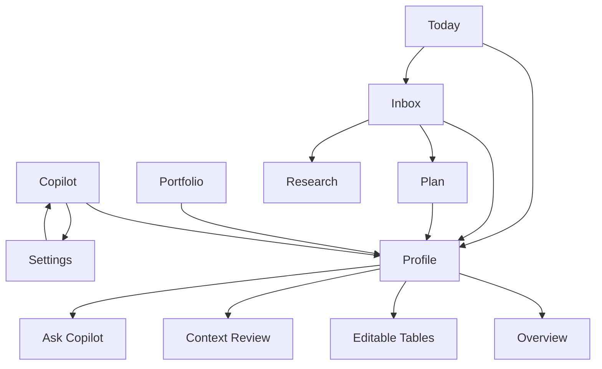
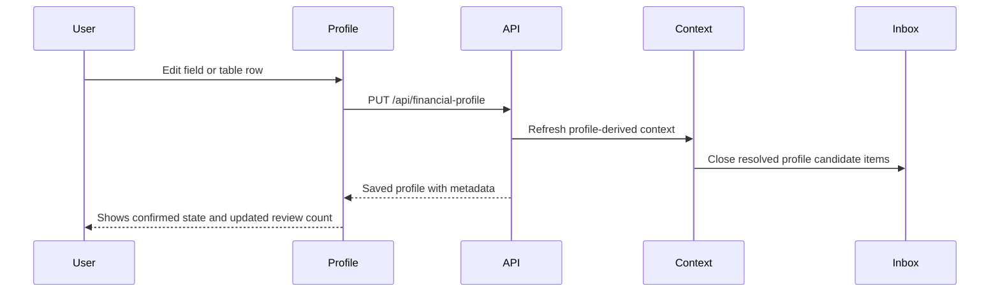
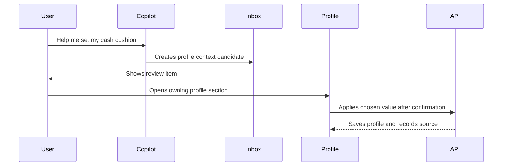

# BuildWealth v2 Profile and Settings UX Plan

## Date
2026-05-08

## Status
Planning document for v2 user navigation, Profile, Settings, and context visibility.

## Product Thesis

BuildWealth needs first-class v2 surfaces for:

- the user's financial profile
- AI and provider settings
- context quality and source review

The classic UI already has Profile and Settings pages, and the backend APIs already exist. The v2 app should now make these surfaces visible, polished, and understandable for a non-expert user.

The Profile page should be the user-facing expression of Context Intelligence. It should answer:

- What does BuildWealth know about me?
- Which facts are confirmed?
- Which facts came from Copilot, imports, portfolio data, plans, or research?
- Which facts need review before I rely on advice?
- How do I update this without understanding technical financial terminology?

The Settings page should answer:

- Which AI provider is Copilot using?
- Is my API key configured and working?
- Which model and endpoint are active?
- Are optional context and embedding features enabled?
- What data protection and local backup settings are active?

## Current State

Classic UI has:

- `/#profile`
- `/#settings`

v2 currently has:

- Today
- Portfolio
- Plan
- Copilot
- Research
- Atelier
- Inbox

v2 does not currently expose Profile or Settings as first-class navigation items.

Backend APIs already available:

- `GET /api/financial-profile`
- `PUT /api/financial-profile`
- `GET /api/onboarding/status`
- `GET /api/settings`
- `PUT /api/settings`
- `POST /api/settings/test-llm`
- `GET /api/context/candidates`
- `PATCH /api/context/candidates/{id}/lifecycle`
- `GET /api/context/candidates/{id}/events`

## Recommended Navigation

Add a new sidebar section called **Foundation**.

Profile belongs in the main navigation because it directly changes Copilot, planning, recommendations, and portfolio-fit behavior. Settings should also be visible, but visually quieter than daily workflow pages.

Recommended v2 sidebar:

```text
BuildWealth
The Wealth Almanac

Daily
  I    Today
  II   Portfolio
  III  Plan
  IV   Copilot

Foundation
  V    Profile
  VI   Inbox
  VII  Research

System
  VIII Settings

Footer
  Classic UI
```

Alternative compact option:

```text
Daily
  Today
  Portfolio
  Plan
  Copilot

Studio
  Research
  Atelier
  Inbox

Personal
  Profile
  Settings
```

Recommendation: use **Foundation** because Profile, Inbox, and Research are all context-quality surfaces. They are not just app settings, and they are not just creative studio tools.

## User Navigation Model



Common entry points:

- Sidebar: user opens Profile directly.
- Today: missing profile facts or stale assumptions link to Profile.
- Copilot: profile setup prompts link to Profile after a draft is created.
- Inbox: context candidates link to the owning Profile section.
- Portfolio: investment-policy warnings link to Profile investment policy.
- Settings: failed provider state links from Copilot fallback warnings.

## Profile Page UX

### Page Name

Use **Profile** in navigation.

Use **Your Financial Picture** as the page heading.

This avoids making the user feel like they are filling out a tax form. The term "profile" is useful in navigation, but the page should explain itself in human terms.

### Top-Level Layout

```text
+--------------------------------------------------------------------+
| Your Financial Picture                         Last updated 2m ago |
| BuildWealth uses this to personalize planning, Copilot, and review |
|                                                                    |
| [82% complete] [3 items need review] [2 stale assumptions]         |
+--------------------------------------------------------------------+
| Review Before Relying On Advice                                    |
| - Your tax rate may conflict with your active plan                 |
| - Cash runway is unknown, so investment-fit advice is less certain |
| [Review in Inbox] [Ask Copilot to explain]                         |
+--------------------------------------------------------------------+
| Tabs                                                               |
| Overview | Income & Spending | Debt & Goals | Taxes | Investing   |
| Assets | Data Quality                                              |
+--------------------------------------------------------------------+
| Active tab content                                                 |
+--------------------------------------------------------------------+
```

### Profile Overview

Purpose: help the user understand what is known without editing every field.

Recommended modules:

- **Household Snapshot**
  - income total
  - expense total
  - monthly surplus
  - debt total
  - goals count
  - cash runway if available
- **Planning Inputs**
  - filing status
  - tax rates
  - retirement horizon
  - contribution assumptions
  - plan link
- **Investment Guardrails**
  - risk tolerance
  - max single-symbol exposure
  - minimum cash runway
  - restricted symbols/sectors
  - tax sensitivity
- **Needs Review**
  - pending profile context candidates
  - stale profile metadata
  - conflicts with active plan or recommendations

### Editable Tables

Use dense but friendly tables. Each table should make source and status visible.

General table pattern:

```text
+----------------------------------------------------------------------------+
| Income                                                          [+ Add]     |
+------------+------------+------------+------------+------------+-----------+
| Item       | Amount     | Timing     | Source     | Status     | Actions   |
+------------+------------+------------+------------+------------+-----------+
| Salary     | $9,500/mo  | ongoing    | You        | Confirmed  | Edit      |
| Bonus      | $12k/yr    | annual     | Copilot    | Review     | Review    |
+------------+------------+------------+------------+------------+-----------+
```

Core tables:

- **Income**
  - item
  - monthly amount
  - pre-tax
  - growth rate
  - start/end dates
  - source
  - status
  - actions
- **Expenses**
  - item
  - monthly amount
  - category
  - fixed or variable
  - inflation assumption
  - source
  - status
  - actions
- **Debt**
  - debt
  - balance
  - interest rate
  - minimum payment
  - payoff approach
  - source
  - status
  - actions
- **Goals**
  - goal
  - target amount
  - target date
  - priority
  - linked plan
  - source
  - status
  - actions
- **Taxes**
  - filing status
  - marginal tax rate
  - effective tax rate
  - state tax rate
  - state
  - source
  - status
  - actions
- **Investment Policy**
  - plain-language guardrail
  - current value
  - why it matters
  - source
  - status
  - actions
- **Physical Assets**
  - asset
  - type
  - current value
  - growth assumption
  - purchase date
  - source
  - status
  - actions

### Investment Policy UX

This section is important because many users will not know what "investment policy" means.

Use plain-language labels first, with technical field names hidden or secondary.

Examples:

| Plain label | Field | User-facing explanation |
| --- | --- | --- |
| Single investment limit | `max_single_symbol_exposure_pct` | The most of your portfolio BuildWealth should be comfortable seeing in one stock or fund. |
| Minimum cash cushion | `minimum_cash_runway_months` | How many months of expenses you want available before taking more investment risk. |
| Risk comfort | `risk_tolerance` | How much volatility you are willing to accept. |
| Tax sensitivity | `tax_sensitivity` | How careful BuildWealth should be about taxable sales or tax-heavy investments. |
| Restricted investments | `restricted_symbols` | Investments BuildWealth should avoid suggesting. |

Recommended layout:

```text
Investing Guardrails

+----------------------+--------------------+----------------------------+
| Guardrail            | Current Answer     | Why BuildWealth Uses It    |
+----------------------+--------------------+----------------------------+
| Single investment    | 10% max            | Avoids overconcentration   |
| Minimum cash cushion | 6 months           | Protects short-term needs  |
| Tax sensitivity      | High               | Reduces taxable surprises  |
+----------------------+--------------------+----------------------------+

[Edit Guardrails] [Ask Copilot to help me choose]
```

### Context and Source Status

Every material row should show a user-friendly status:

- **Confirmed**
  - user or trusted source confirmed it
- **Needs review**
  - BuildWealth found it, but it should not be treated as final yet
- **Possibly outdated**
  - old enough that advice may be less reliable
- **Conflict**
  - two parts of the app disagree and the user should resolve it
- **Draft**
  - Copilot prepared it but it has not been applied

Avoid exposing raw internal labels such as `high`, `critical`, `pending_review`, or `authoritative_after_apply` in the main UI. Those can remain in traces and diagnostics.

### Conflict Copy

Conflicts should be written in plain language.

Example:

```text
This needs review before BuildWealth relies on it.

Your profile says your marginal tax rate is 24%, but your active plan uses 32%.
That can change Roth conversion, contribution, and tax-loss harvesting guidance.

[Use 24%] [Use 32%] [Ask Copilot to explain] [Decide later]
```

Important rule: users should not "dismiss" material conflicts in a way that degrades the system. They can:

- accept one value
- reject the candidate
- defer it
- ask for an explanation
- ask for a recommendation

Deferral should keep the conflict visible where it matters.

## Settings Page UX

### Page Name

Use **Settings** in navigation.

Use **Connections & AI** as the page heading.

### Top-Level Layout

```text
+--------------------------------------------------------------------+
| Connections & AI                                                   |
| Configure Copilot, provider access, and local data protection      |
+--------------------------------------------------------------------+
| AI Provider                                                        |
| Provider [OpenAI v]                                                |
| API key  [****************]                                        |
| Model    [gpt-5.5]                                                 |
| Base URL [https://api.openai.com/v1]                               |
| [Save] [Test provider]                                             |
| Status: Provider test passed                                       |
+--------------------------------------------------------------------+
| Context Intelligence                                               |
| Context engine: On                                                 |
| Embeddings: Off for now                                            |
| Local embedding provider: Ollama, not configured                   |
+--------------------------------------------------------------------+
| Local Data Protection                                              |
| Backups, protection policy, restore tools                          |
+--------------------------------------------------------------------+
```

### AI Provider Section

Fields:

- provider
- API key
- model
- base URL
- timeout seconds
- max output tokens
- parallel tool calls

Actions:

- Save
- Test Provider
- Reset to provider defaults
- Clear API key

States:

- Not configured
- Configured but untested
- Test passed
- Test failed
- Provider changed, API key required

Copy should avoid developer-only wording.

Use:

```text
Copilot needs an API key before it can use live AI responses.
```

Instead of:

```text
LLM API key is not configured.
```

### Embeddings and Context Settings

Do not make embeddings prominent yet. The user should not need to know what embeddings are to use the app.

Recommended copy:

```text
Context search
BuildWealth can optionally use a local embedding model to search older notes,
research, and conversation history. Structured profile, plan, and portfolio
data still remain the source of truth.
```

Controls:

- Context Intelligence: enabled by default, read-only for now
- Narrative context search: off or experimental
- Provider: disabled, local Ollama, custom
- Model: `nomic-embed-text`
- Base URL: `http://localhost:11434`
- Test local embedding provider

This section can come after v2 Profile and basic Settings.

## Profile Editing Workflow

### Direct Edit



### Copilot-Assisted Edit



### Conflict Resolution

```text
Conflict appears
  -> user sees plain-language explanation
  -> user chooses one of:
       Accept profile value
       Accept candidate value
       Keep current source
       Ask Copilot to explain
       Decide later
  -> BuildWealth records the choice
  -> Context candidate lifecycle updates
  -> Copilot trace no longer treats the unresolved conflict as authoritative
```

## Data Model Needs

The existing profile payload supports core profile data, but the v2 page should increasingly depend on metadata.

Need to expose or normalize:

- field path
- display label
- current value
- source type
- source ref
- source label
- confidence
- review status
- last confirmed at
- stale after date
- conflict refs
- owning route

Recommended read model:

```json
{
  "field_path": "tax_profile.marginal_tax_rate",
  "label": "Marginal tax rate",
  "plain_language_value": "32%",
  "source_label": "You",
  "status_label": "Confirmed",
  "last_confirmed_at": "2026-05-08T16:00:00Z",
  "review_route": "#profile?section=taxes"
}
```

This can be derived server-side without changing the canonical profile schema immediately.

## Access and Deep Links

Add stable v2 routes:

- `#profile`
- `#profile?section=overview`
- `#profile?section=income`
- `#profile?section=expenses`
- `#profile?section=debt`
- `#profile?section=goals`
- `#profile?section=taxes`
- `#profile?section=investing`
- `#profile?section=assets`
- `#profile?section=data-quality`
- `#settings`
- `#settings?section=ai`
- `#settings?section=context`
- `#settings?section=data-protection`

Context candidates should use these as `review_route` targets where possible.

## Implementation Slices

### Slice 1: v2 Settings Page

- Add `web-v2/views/settings.js`
- Add v2 API helpers for settings and provider test
- Add Settings navigation
- Implement AI provider form
- Implement save and masked API key behavior
- Implement provider defaults and Test Provider
- Add focused JS tests
- Verify in Docker that `/v2#settings` works

Acceptance:

- user can set OpenAI or another provider from v2
- masked saved keys do not overwrite stored keys
- provider change clears old masked key behavior correctly
- Copilot uses new settings without container restart

### Slice 2: v2 Profile Read-Only Overview

- Add `web-v2/views/profile.js`
- Add Profile navigation
- Load `/api/financial-profile`
- Load `/api/onboarding/status`
- Render profile completeness and review status
- Render read-only summary sections
- Add links to Inbox and Copilot prompts

Acceptance:

- user can find Profile from v2 sidebar
- user can understand what data is known
- missing or stale fields are visible in plain language

### Slice 3: v2 Profile Editable Tables

- Add editable tables for income, expenses, debt, goals, taxes, assets
- Reuse classic profile validation logic where possible
- Save through `PUT /api/financial-profile`
- Preserve existing metadata where possible
- Add empty states and add-row flows

Acceptance:

- user can add/edit/remove core profile rows
- changes are saved and visible after reload
- onboarding status refreshes after save

### Slice 4: Investment Policy UX

- Add dedicated Investing tab
- Render plain-language guardrails
- Add edit controls for investment policy fields
- Link to Copilot investment-policy helper
- Surface conflicts from context candidates

Acceptance:

- user can understand and update investment guardrails
- portfolio-fit warnings link back to this section
- Copilot can guide but does not apply without confirmation

### Slice 5: Context-Aware Profile Metadata

- Add server-side profile read model for field status rows
- Show source, status, last confirmed, and review route in tables
- Link pending context candidates to owning Profile section
- Resolve candidate review items when profile source is updated

Acceptance:

- material profile facts show source and review status
- unresolved conflicts stay visible
- resolved profile candidates close or move lifecycle appropriately

### Slice 6: Context and Embedding Settings

- Add Settings section for Context Intelligence
- Show context engine as enabled by default
- Add experimental narrative context search controls
- Add local embedding provider fields
- Add provider test endpoint only if backend support exists

Acceptance:

- embeddings are clearly optional
- structured profile, plan, and portfolio data remain described as source of truth
- users are not required to understand embedding terminology to use Copilot

## Testing Plan

Unit/browser tests:

- v2 Settings renders provider fields
- saving masked API key does not clear stored value
- changing provider clears stale key
- Test Provider status renders success and failure
- v2 Profile renders onboarding status
- profile tables render empty and populated states
- profile edits call `PUT /api/financial-profile`
- deep links open correct Profile section
- context candidate links route to owning Profile section

Manual Docker smoke:

- `http://localhost:8090/v2#settings`
- save provider fields
- test provider
- `http://localhost:8090/v2#profile`
- add income row
- add tax basics
- add investing guardrail
- reload and verify persistence
- ask Copilot a profile-sensitive question and verify context trace references updated Profile

## Recommendation

Build v2 Settings first because it unblocks Copilot setup for new users.

Then build v2 Profile in two passes:

1. read-only overview with onboarding and review links
2. editable tables plus context metadata

This sequence gets users unstuck quickly while moving the product toward the real goal: the app itself becomes the visual interface for Context Intelligence.
